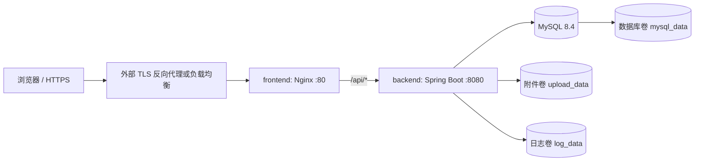

# 计算机技术组外包需求管理系统

[](https://github.com/7wid/Progress-passage-work/actions/workflows/ci.yml)

面向校内需求方、计算机技术组成员和管理员的需求协作平台，覆盖需求提交、技术评估、任务分配、进度记录、附件、交付验收、站内通知、管理后台、统计与审计。

## 技术栈

- 前端：Vue 3、TypeScript、Vite、Element Plus、Pinia、Vue Router。
- 后端：JDK 21、Spring Boot 3.5、Spring Security、Spring Session JDBC。
- 数据：MyBatis-Plus、MySQL 8.4、Flyway。
- 部署：Docker Compose、Nginx。

## 项目目录

```text
.
├─ backend/                 Spring Boot API、Flyway 迁移
├─ frontend/                Vue 单页应用
├─ deploy/                  生产镜像、Nginx、环境变量模板
├─ docs/                    需求、流程与开发规范
├─ docker-compose.yml       本地开发 MySQL
└─ docker-compose.prod.yml  完整生产栈
```

详细业务和工程规则见：

- [需求文档](docs/需求文档.md)
- [项目流程书](docs/项目流程书.md)
- [项目开发规范](docs/项目开发规范.md)

## 环境要求

本地开发：

- JDK 21
- Node.js 22.12 或更高的 22 LTS
- pnpm 10
- Docker Desktop 或 Docker Engine（含 Compose v2）
- 后端统一使用仓库内 Maven Wrapper，不要求全局安装 Maven

Docker 部署主机建议至少提供 2 核 CPU、4 GB 内存和足够的数据库/附件磁盘空间。正式环境必须配置 HTTPS、定期备份并限制主机防火墙只开放必要端口。

## 本地开发

### 1. 启动 MySQL

开发 Compose 使用独立项目名 `tech-request-dev`，不会与生产卷混用：

```powershell
docker compose up -d mysql
docker compose ps
```

默认连接信息为 `localhost:3306`、数据库/用户 `tech_request`、密码 `change-me-local`。如端口冲突，可先设置 `$env:MYSQL_PORT = "3307"`，并同步修改本地后端 JDBC 地址。

### 2. 配置并启动后端

```powershell
Copy-Item backend/src/main/resources/application-local.example.yml `
  backend/src/main/resources/application-local.yml

Set-Location backend
$env:SPRING_PROFILES_ACTIVE = "local"
$bootstrapAdminSecret = Read-Host "请输入初始管理员密码（至少 12 位，含字母和数字）" -AsSecureString
$env:APP_BOOTSTRAP_ADMIN_PASSWORD = `
  [System.Net.NetworkCredential]::new("", $bootstrapAdminSecret).Password
Remove-Variable bootstrapAdminSecret
.\mvnw.cmd spring-boot:run
```

初始账号默认为 `admin`。账号已经存在时不会重置密码；需要改密请登录后通过系统功能处理。停止后可清理当前 PowerShell 会话中的密码：

```powershell
Remove-Item Env:APP_BOOTSTRAP_ADMIN_PASSWORD -ErrorAction SilentlyContinue
```

`application-local.yml` 含本机密码且已被 Git 忽略，不得提交。

### 3. 配置并启动前端

在另一个终端执行：

```powershell
Set-Location frontend
Copy-Item .env.example .env.local
corepack enable
pnpm install --frozen-lockfile
pnpm dev
```

### 4. 本地地址

- 前端：http://localhost:5173
- 后端：http://localhost:8080
- 健康检查：http://localhost:8080/actuator/health
- OpenAPI：http://localhost:8080/v3/api-docs
- Swagger UI：http://localhost:8080/swagger-ui.html

生产 profile 默认关闭 OpenAPI 和 Swagger UI。

## 提交前检查

```powershell
Set-Location backend
.\mvnw.cmd clean test

Set-Location ..\frontend
pnpm typecheck
pnpm lint
pnpm test
pnpm build

Set-Location ..
git diff --check
git status --short
```

## GitHub 自动检查

仓库包含 [`.github/workflows/ci.yml`](.github/workflows/ci.yml)。不需要数据库密码或其他 GitHub Secret，推送代码后 GitHub Actions 会自动并行执行：

- `Backend / test`：JDK 21、Maven Wrapper、编译和全部后端测试。
- `Frontend / quality`：Node.js 22、pnpm 10、类型检查、ESLint、单元测试和生产构建。
- `Configuration / validate`：开发和生产 Docker Compose 配置解析。

触发条件：

- 向任意分支 `push`。
- 创建或更新目标为 `main` 的 Pull Request。
- 在 GitHub 的 **Actions → CI → Run workflow** 手动运行。

第一次启用流程：

1. 提交并推送 `.github/workflows/ci.yml`。
2. 打开仓库的 **Actions** 页面，进入最新的 `CI` 运行记录。
3. 三个检查都显示绿色后再创建或合并 Pull Request。
4. 若 Actions 被仓库禁用，先在 **Actions** 页面确认启用仓库工作流。

建议保护 `main`，防止红灯代码被合并：

1. 打开 **Settings → Rules → Rulesets**（旧界面为 **Branches → Branch protection rules**）。
2. 新建针对 `main` 的 branch ruleset。
3. 开启 **Require a pull request before merging**。
4. 开启 **Require status checks to pass**，选择：
   - `Backend / test`
   - `Frontend / quality`
   - `Configuration / validate`
5. 建议同时禁止 force push、禁止删除 `main`，并要求分支在合并前保持最新。

这里的“静态检查”主要是 TypeScript、ESLint、Java 编译和测试，不等同于安全漏洞扫描。若仓库公开，或账号已启用 GitHub Code Security，可在 **Settings → Security → Advanced Security → CodeQL analysis → Set up → Default** 开启 CodeQL，选择 Java 和 JavaScript/TypeScript。不要同时再添加一套重复的 CodeQL advanced workflow。

## Docker 生产部署

### 部署结构



`docker-compose.prod.yml` 只向主机发布前端端口；MySQL 和后端只在 Compose 内部网络可达。生产 Nginx 提供 HTTP，公网 HTTPS 应由宿主机上的 Caddy/Nginx、云负载均衡或网关终止，再转发到 `${HTTP_PORT}`。

### 1. 准备代码和 Docker

在部署主机上检出经过审核的 release/tag，然后确认 Docker 可用：

```powershell
docker version
docker compose version
git status --short
```

不要从带未提交修改的工作区构建生产镜像。

### 2. 创建生产环境变量

```powershell
Copy-Item deploy/.env.prod.example deploy/.env.prod
```

生成数据库随机密码的 PowerShell 示例（分别执行两次）：

```powershell
$randomBytes = [byte[]]::new(32)
[Security.Cryptography.RandomNumberGenerator]::Fill($randomBytes)
[Convert]::ToBase64String($randomBytes)
Remove-Variable randomBytes
```

编辑 `deploy/.env.prod`：

| 变量 | 必填 | 说明 |
| --- | --- | --- |
| `MYSQL_PASSWORD` | 是 | 应用数据库用户密码，使用长随机值 |
| `MYSQL_ROOT_PASSWORD` | 是 | MySQL root 密码，与应用密码不同 |
| `APP_WEB_ORIGIN` | 是 | 浏览器实际访问源，例如 `https://requests.example.edu.cn`，不要带路径 |
| `HTTP_PORT` | 否 | 宿主机 HTTP 端口，默认 `80` |
| `SESSION_COOKIE_SECURE` | 是 | 正式 HTTPS 环境必须为 `true` |
| `APP_BOOTSTRAP_ADMIN_ENABLED` | 首次启动 | 第一次启动设为 `true`，完成初始化后改为 `false` |
| `APP_BOOTSTRAP_ADMIN_ACCOUNT` | 首次启动 | 初始管理员账号，默认 `admin` |
| `APP_BOOTSTRAP_ADMIN_PASSWORD` | 首次启动 | 12～72 字符，含字母和数字，UTF-8 不超过 72 字节 |
| `APP_BOOTSTRAP_ADMIN_DISPLAY_NAME` | 首次启动 | 初始管理员显示名称 |

注意：

- `deploy/.env.prod` 已被 Git 忽略，禁止提交、截图或发送给他人。
- 不要复用示例密码。若手写值含空格或 `#`，应按 Compose env 文件语法正确加引号；推荐直接使用上述 Base64 随机值。
- 如果只在隔离的内网用纯 HTTP 临时验收，需同时设置 `APP_WEB_ORIGIN=http://主机地址` 和 `SESSION_COOKIE_SECURE=false`。公网生产不得这样配置。

Linux 主机还应限制文件权限：

```bash
chmod 600 deploy/.env.prod
```

### 3. 校验配置

下面的命令只校验，不启动容器，也不会在终端打印展开后的密码：

```powershell
docker compose --env-file deploy/.env.prod `
  -f docker-compose.prod.yml config --quiet
```

本仓库已显式设置 Compose 项目名 `tech-request-prod`，即使项目路径包含中文，也不需要额外传 `-p`。

### 4. 构建并启动

建议先完成“提交前检查”，再执行：

```powershell
docker compose --env-file deploy/.env.prod `
  -f docker-compose.prod.yml build --pull

docker compose --env-file deploy/.env.prod `
  -f docker-compose.prod.yml up -d --remove-orphans
```

启动顺序由健康检查控制：MySQL 健康后启动后端，Flyway 自动校验并执行迁移，后端健康后再启动前端。

### 5. 验证部署

```powershell
docker compose --env-file deploy/.env.prod `
  -f docker-compose.prod.yml ps

docker compose --env-file deploy/.env.prod `
  -f docker-compose.prod.yml logs backend --tail 200

curl.exe --fail http://localhost:80/actuator/health
```

如果修改过 `HTTP_PORT`，相应替换健康检查端口。接入 HTTPS 后，再从外部验证：

```powershell
curl.exe --fail https://requests.example.edu.cn/actuator/health
```

预期响应包含 `"status":"UP"`。随后打开页面，用 `.env.prod` 中的初始管理员账号登录，检查需求列表、附件上传和管理入口。

### 6. 关闭首次管理员初始化

确认管理员已创建且能登录后，立即编辑 `deploy/.env.prod`：

```env
APP_BOOTSTRAP_ADMIN_ENABLED=false
APP_BOOTSTRAP_ADMIN_PASSWORD=
```

然后只重建后端容器环境：

```powershell
docker compose --env-file deploy/.env.prod `
  -f docker-compose.prod.yml up -d --force-recreate backend
```

初始化器遇到已存在的 ADMIN 账号会跳过创建，但关闭开关并清除明文环境变量仍是必须的安全收尾。修改该密码变量不会重置已有管理员密码。

## 日常运维

为避免重复，以下示例用 `$compose` 保存参数：

```powershell
$compose = @("compose", "--env-file", "deploy/.env.prod", "-f", "docker-compose.prod.yml")
docker @compose ps
docker @compose logs -f --tail 200 backend
```

常用命令：

```powershell
# 重启后端
docker @compose restart backend

# 停止并删除容器/网络，保留数据库、附件和日志卷
docker @compose down

# 重新启动
docker @compose up -d
```

绝不要在没有完整备份时执行 `docker compose down -v`；`-v` 会删除数据库、附件和日志卷。

### 数据位置

Compose 使用三个命名卷：

- `tech-request-prod_mysql_data`：MySQL 数据。
- `tech-request-prod_upload_data`：用户上传附件。
- `tech-request-prod_log_data`：后端滚动日志。

数据库和附件必须一起备份，才能保持附件元数据与物理文件一致。

### 备份

以下示例适用于 PowerShell 7：

```powershell
New-Item -ItemType Directory -Force backup | Out-Null
$stamp = Get-Date -Format "yyyyMMdd-HHmmss"

# MySQL 逻辑备份
docker @compose exec -T mysql sh -c `
  'exec mysqldump -uroot -p"$MYSQL_ROOT_PASSWORD" --single-transaction --routines --triggers tech_request' `
  > ".\backup\tech_request-$stamp.sql"

# 附件卷备份
$backupDir = (Resolve-Path .\backup).Path
docker run --rm `
  --mount "type=volume,src=tech-request-prod_upload_data,dst=/source,readonly" `
  --mount "type=bind,src=$backupDir,dst=/backup" `
  alpine:3.22 tar czf "/backup/uploads-$stamp.tar.gz" -C /source .
```

定期把备份复制到不同主机或对象存储，并实际演练恢复。恢复会覆盖数据，必须在维护窗口停止前后端，并由熟悉 MySQL 和 Docker 卷的运维人员执行。

### 升级

1. 备份数据库和附件。
2. 检出新的已审核 release/tag。
3. 运行后端测试和前端检查。
4. 构建新镜像并滚动重建：

```powershell
docker @compose build --pull
docker @compose up -d --remove-orphans
docker @compose ps
docker @compose logs backend --tail 200
```

Flyway 会在后端启动时自动迁移数据库。不要修改已经执行过的迁移文件。若新版本包含不可逆数据库迁移，代码回退通常还需要恢复升级前数据库备份，不能只切回旧镜像。

## 故障排查

### `Web server failed to start. Port 8080 was already in use`

本地已有后端进程占用端口：

```powershell
Get-NetTCPConnection -LocalPort 8080 -State Listen
Get-Process -Id <OwningProcess>
```

确认进程后正常停止它，不要同时启动两份后端。生产 Compose 不向主机发布 8080，因此通常不会发生该冲突。

### Docker 无法连接

若出现 `failed to connect to the docker API`，先启动 Docker Desktop（或 Linux Docker daemon），再运行 `docker version`。只有客户端版本信息而没有 Server 信息，表示守护进程未运行。

### MySQL `Access denied`

MySQL 首次初始化后，修改 `.env.prod` 不会自动修改卷内已有账号密码。应使用原密码登录后显式修改账号，或从备份恢复；不要为了修密码直接删除生产卷。

查看日志：

```powershell
docker @compose logs mysql --tail 200
docker @compose logs backend --tail 300
```

### 登录失败或不断跳回登录页

依次检查：

1. `APP_WEB_ORIGIN` 是否与浏览器地址的协议、域名和端口完全一致。
2. HTTPS 环境是否为 `SESSION_COOKIE_SECURE=true`。
3. 纯 HTTP 临时环境是否误用了 Secure Cookie。
4. 外部反向代理是否传递 `X-Forwarded-Proto: https`。
5. 浏览器是否仍保存旧环境 Cookie；必要时清理该站点 Cookie 后重试。

### 后端不健康

```powershell
docker @compose ps
docker @compose logs backend --tail 300
```

重点查看 Flyway 校验、数据库认证、磁盘权限和上传/日志卷空间。后端容器以非 root 用户运行，不能把附件目录改挂到一个无写权限的任意宿主目录。

### 查看最终配置时保护秘密

`docker compose config` 会展开并打印环境变量。日常仅使用 `config --quiet`；不要把完整配置输出粘贴到 issue、聊天或 CI 日志。

## 安全与数据约束

- 生产只暴露 Nginx，MySQL 和后端不映射宿主机端口。
- Session Cookie 使用 HttpOnly、SameSite=Lax，正式环境启用 Secure。
- 附件存储在私有卷，通过鉴权接口下载，不直接由 Nginx 暴露。
- 容器启用 `no-new-privileges`；后端以 UID/GID 10001 的非 root 用户运行。
- 数据库结构只通过新 Flyway 迁移演进，禁止改写已执行迁移。
- 密码、`.env.prod`、`application-local.yml`、私钥和备份文件不得提交到 Git。
