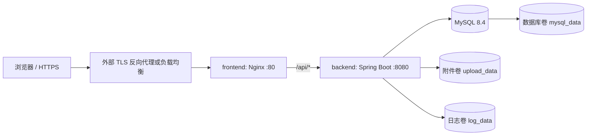

# 源码构建部署与运维

> 更新：2026-09-12。以下命令从仓库根目录执行，适用于新建、使用命名卷的源码构建环境。既有 Linux 生产服务器使用独立部署目录和 /data/volumes 绑定目录，请使用[服务器准备指南](持续部署服务器准备指南.md)，不要在该服务器直接执行本文初始化或重建命令。

### 部署结构



`docker-compose.prod.yml` 只向主机发布前端端口；MySQL 和后端只在 Compose 内部网络可达。生产 Nginx 提供 HTTP，公网 HTTPS 应由宿主机上的 Caddy/Nginx、云负载均衡或网关终止，再转发到 `${HTTP_PORT}`。

### 1. 准备代码和 Docker

在部署主机上检出经过审核的 release/tag，然后确认 Docker 可用：

```powershell
docker version
docker compose version
git status --short
```

不要从带未提交修改的工作区构建生产镜像。

### 2. 创建生产环境变量

```powershell
Copy-Item deploy/.env.prod.example deploy/.env.prod
```

生成数据库随机密码的 PowerShell 示例（分别执行两次）：

```powershell
$randomBytes = [byte[]]::new(32)
[Security.Cryptography.RandomNumberGenerator]::Fill($randomBytes)
[Convert]::ToBase64String($randomBytes)
Remove-Variable randomBytes
```

编辑 `deploy/.env.prod`：

| 变量                                                       | 必填           | 说明                                                                 |
| ---------------------------------------------------------- | -------------- | -------------------------------------------------------------------- |
| `MYSQL_PASSWORD`                                           | 是             | 应用数据库用户密码，使用长随机值                                     |
| `MYSQL_ROOT_PASSWORD`                                      | 是             | MySQL root 密码，与应用密码不同                                      |
| `APP_WEB_ORIGIN`                                           | 是             | 浏览器实际访问源，例如 `https://requests.example.edu.cn`，不要带路径 |
| `HTTP_PORT`                                                | 否             | 宿主机 HTTP 端口，默认 `80`                                          |
| `SESSION_COOKIE_SECURE`                                    | 是             | 正式 HTTPS 环境必须为 `true`                                         |
| `APP_REGISTRATION_ENABLED`                                 | 否             | 是否开放需求方自助注册；生产默认关闭，正式开放时必须显式设为 `true`  |
| `APP_REGISTRATION_EMAIL_SUFFIX`                            | 否             | 可限制注册邮箱后缀，例如 `@example.edu.cn`                           |
| `APP_LOGIN_SECURITY_MAX_FAILED_ATTEMPTS`                   | 否             | 连续登录失败锁定阈值，默认 `5`，允许 `3～20`                         |
| `APP_LOGIN_SECURITY_LOCK_DURATION`                         | 否             | 达到阈值后的锁定时长，默认 `15m`                                     |
| `APP_PASSWORD_RECOVERY_ENABLED`                            | 否             | 邮箱找回密码开关，默认 `false`，独立于注册开关                       |
| `APP_PASSWORD_RECOVERY_FROM`                               | 开启找回时必填 | SMTP 授权的发件邮箱                                                  |
| `APP_PASSWORD_RECOVERY_RESET_URL`                          | 开启找回时必填 | 可信 HTTPS 重置地址，例如 `https://job.gxutech.xyz/reset-password`   |
| `APP_PASSWORD_RECOVERY_TOKEN_TTL`                          | 否             | 重置链接有效期，默认 `15m`，允许 5～30 分钟                          |
| `SMTP_HOST` / `SMTP_PORT`                                  | 开启找回时必填 | 邮件服务器，默认端口 `587`                                           |
| `SMTP_USERNAME` / `SMTP_PASSWORD`                          | 按邮件服务要求 | 专用发信账号与授权码，仅在服务器安全配置                             |
| `SMTP_AUTH` / `SMTP_STARTTLS_ENABLED` / `SMTP_SSL_ENABLED` | 否             | 默认 `true` / `true` / `false`；非本机 SMTP 必须使用 TLS             |
| `APP_BOOTSTRAP_ADMIN_ENABLED`                              | 首次启动       | 第一次启动设为 `true`，完成初始化后改为 `false`                      |
| `APP_BOOTSTRAP_ADMIN_ACCOUNT`                              | 首次启动       | 初始管理员账号，默认 `admin`                                         |
| `APP_BOOTSTRAP_ADMIN_PASSWORD`                             | 首次启动       | 12～72 字符，含字母和数字，UTF-8 不超过 72 字节                      |
| `APP_BOOTSTRAP_ADMIN_DISPLAY_NAME`                         | 首次启动       | 初始管理员显示名称                                                   |

注意：

- `deploy/.env.prod` 已被 Git 忽略，禁止提交、截图或发送给他人。
- 不要复用示例密码。若手写值含空格或 `#`，应按 Compose env 文件语法正确加引号；推荐直接使用上述 Base64 随机值。
- 已经部署过的服务器会继续使用原有 `.env.prod`。如果其中仍是 `APP_REGISTRATION_ENABLED=false`，发布新镜像不会自动开放注册，必须先评估开放范围并显式改为 `true`；校内服务建议同时设置邮箱后缀。
- 如果只在隔离的内网用纯 HTTP 临时验收，需同时设置 `APP_WEB_ORIGIN=http://主机地址` 和 `SESSION_COOKIE_SECURE=false`。公网生产不得这样配置。

Linux 主机还应限制文件权限：

```bash
chmod 600 deploy/.env.prod
```

### 3. 校验配置

下面的命令只校验，不启动容器，也不会在终端打印展开后的密码：

```powershell
docker compose --env-file deploy/.env.prod `
  -f docker-compose.prod.yml config --quiet
```

本仓库已显式设置 Compose 项目名 `tech-request-prod`，即使项目路径包含中文，也不需要额外传 `-p`。

准备源码构建发布时可运行配置与质量预检（不包含服务器拉取端、SMTP、真实数据库迁移和恢复演练）。脚本不会打印环境变量、构建镜像或启动容器；默认要求工作区已提交且干净：

```powershell
powershell -NoProfile -ExecutionPolicy Bypass -File deploy/Test-ReleaseReadiness.ps1
```

代码审查阶段可临时使用 `-AllowDirtyWorktree`，已经单独完成质量门禁时可再传 `-SkipQualityChecks`。正式发布前仍应使用默认参数执行一次完整检查。

### 4. 构建并启动

建议先完成[项目开发规范](项目开发规范.md)中的检查，再执行：

```powershell
docker compose --env-file deploy/.env.prod `
  -f docker-compose.prod.yml build --pull

docker compose --env-file deploy/.env.prod `
  -f docker-compose.prod.yml up -d --remove-orphans
```

启动顺序由健康检查控制：MySQL 健康后启动后端，Flyway 自动校验并执行迁移，后端健康后再启动前端。

### 5. 验证部署

```powershell
docker compose --env-file deploy/.env.prod `
  -f docker-compose.prod.yml ps

docker compose --env-file deploy/.env.prod `
  -f docker-compose.prod.yml logs backend --tail 200

curl.exe --fail http://localhost:80/actuator/health
```

如果修改过 `HTTP_PORT`，相应替换健康检查端口。接入 HTTPS 后，再从外部验证：

```powershell
curl.exe --fail https://requests.example.edu.cn/actuator/health
```

预期响应包含 `"status":"UP"`。启用自助注册后，还应检查公开状态接口：

```powershell
curl.exe --fail https://requests.example.edu.cn/api/v1/users/registration
```

响应中的 `data.enabled` 应为 `true`，配置邮箱后缀时 `data.emailSuffix` 应与预期一致。随后使用一次性验收账号走通注册、登录和退出；不要使用生产管理员账号测试失败锁定策略。详细步骤见 [注册与登录验收](正式注册与登录验收清单.md)。

忘记密码通过绑定邮箱的一次性链接验证身份，重置后注销所有旧会话。生产 SMTP 配置、限流策略、V8 迁移与验收步骤见 [邮箱找回密码部署与验收](邮箱找回密码部署与验收.md)。邮件服务未配置时默认关闭找回功能；无需开启自助注册即可供已有账号使用。

### 6. 关闭首次管理员初始化

确认管理员已创建且能登录后，立即编辑 `deploy/.env.prod`：

```env
APP_BOOTSTRAP_ADMIN_ENABLED=false
APP_BOOTSTRAP_ADMIN_PASSWORD=
```

然后只重建后端容器环境：

```powershell
docker compose --env-file deploy/.env.prod `
  -f docker-compose.prod.yml up -d --force-recreate backend
```

初始化器遇到已存在的 ADMIN 账号会跳过创建，但关闭开关并清除明文环境变量仍是必须的安全收尾。修改该密码变量不会重置已有管理员密码。

## 日常运维

为避免重复，以下示例用 `$compose` 保存参数：

```powershell
$compose = @("compose", "--env-file", "deploy/.env.prod", "-f", "docker-compose.prod.yml")
docker @compose ps
docker @compose logs -f --tail 200 backend
```

常用命令：

```powershell
# 重启后端
docker @compose restart backend

# 停止并删除容器/网络，保留数据库、附件和日志卷
docker @compose down

# 重新启动
docker @compose up -d
```

绝不要在没有完整备份时执行 `docker compose down -v`；`-v` 会删除数据库、附件和日志卷。

### 数据位置

Compose 使用三个命名卷：

- `tech-request-prod_mysql_data`：MySQL 数据。
- `tech-request-prod_upload_data`：用户上传附件。
- `tech-request-prod_log_data`：后端滚动日志。

数据库和附件必须一起备份，才能保持附件元数据与物理文件一致。

### 备份

以下示例适用于 PowerShell 7：

```powershell
New-Item -ItemType Directory -Force backup | Out-Null
$stamp = Get-Date -Format "yyyyMMdd-HHmmss"

# MySQL 逻辑备份
docker @compose exec -T mysql sh -c `
  'exec mysqldump -uroot -p"$MYSQL_ROOT_PASSWORD" --single-transaction --routines --triggers tech_request' `
  > ".\backup\tech_request-$stamp.sql"

# 附件卷备份
$backupDir = (Resolve-Path .\backup).Path
docker run --rm `
  --mount "type=volume,src=tech-request-prod_upload_data,dst=/source,readonly" `
  --mount "type=bind,src=$backupDir,dst=/backup" `
  alpine:3.22 tar czf "/backup/uploads-$stamp.tar.gz" -C /source .
```

定期把备份复制到不同主机或对象存储，并实际演练恢复。恢复会覆盖数据，必须在维护窗口停止前后端，并由熟悉 MySQL 和 Docker 卷的运维人员执行。

### 升级

1. 备份数据库和附件。
2. 检出新的已审核 release/tag。
3. 运行后端测试和前端检查。
4. 构建新镜像并滚动重建：

```powershell
docker @compose build --pull
docker @compose up -d --remove-orphans
docker @compose ps
docker @compose logs backend --tail 200
```

Flyway 会在后端启动时自动迁移数据库。不要修改已经执行过的迁移文件。若新版本包含不可逆数据库迁移，代码回退通常还需要恢复升级前数据库备份，不能只切回旧镜像。

## 故障排查

### `Web server failed to start. Port 8080 was already in use`

本地已有后端进程占用端口：

```powershell
Get-NetTCPConnection -LocalPort 8080 -State Listen
Get-Process -Id <OwningProcess>
```

确认进程后正常停止它，不要同时启动两份后端。生产 Compose 不向主机发布 8080，因此通常不会发生该冲突。

### Docker 无法连接

若出现 `failed to connect to the docker API`，先启动 Docker Desktop（或 Linux Docker daemon），再运行 `docker version`。只有客户端版本信息而没有 Server 信息，表示守护进程未运行。

### MySQL `Access denied`

MySQL 首次初始化后，修改 `.env.prod` 不会自动修改卷内已有账号密码。应使用原密码登录后显式修改账号，或从备份恢复；不要为了修密码直接删除生产卷。

查看日志：

```powershell
docker @compose logs mysql --tail 200
docker @compose logs backend --tail 300
```

### 登录失败或不断跳回登录页

依次检查：

1. `APP_WEB_ORIGIN` 是否与浏览器地址的协议、域名和端口完全一致。
2. HTTPS 环境是否为 `SESSION_COOKIE_SECURE=true`。
3. 纯 HTTP 临时环境是否误用了 Secure Cookie。
4. 外部反向代理是否传递 `X-Forwarded-Proto: https`。
5. 浏览器是否仍保存旧环境 Cookie；必要时清理该站点 Cookie 后重试。

### 后端不健康

```powershell
docker @compose ps
docker @compose logs backend --tail 300
```

重点查看 Flyway 校验、数据库认证、磁盘权限和上传/日志卷空间。后端容器以非 root 用户运行，不能把附件目录改挂到一个无写权限的任意宿主目录。

### 查看最终配置时保护秘密

`docker compose config` 会展开并打印环境变量。日常仅使用 `config --quiet`；不要把完整配置输出粘贴到 issue、聊天或 CI 日志。

## 安全与数据约束

- 生产只暴露 Nginx，MySQL 和后端不映射宿主机端口。
- Session Cookie 使用 HttpOnly、SameSite=Lax，正式环境启用 Secure。
- 附件存储在私有卷，通过鉴权接口下载，不直接由 Nginx 暴露。
- 容器启用 `no-new-privileges`；后端以 UID/GID 10001 的非 root 用户运行。
- 数据库结构只通过新 Flyway 迁移演进，禁止改写已执行迁移。
- 密码、`.env.prod`、`application-local.yml`、私钥和备份文件不得提交到 Git。
