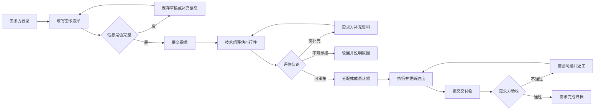
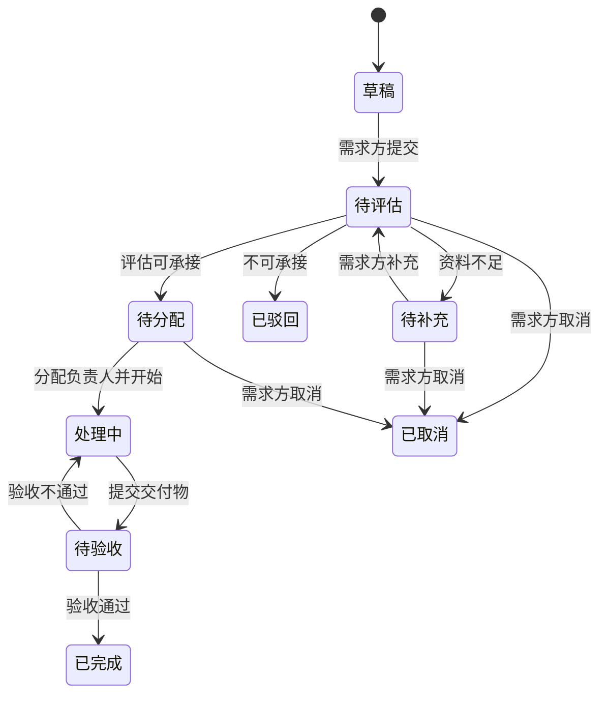
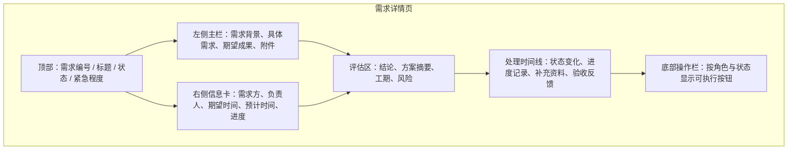
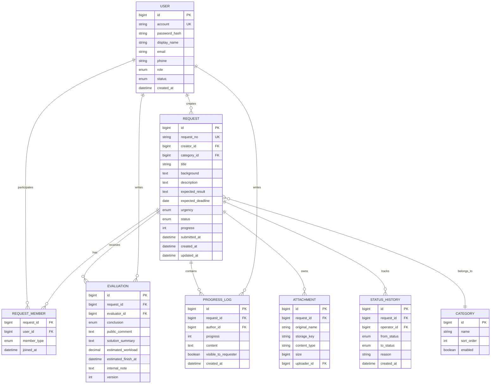
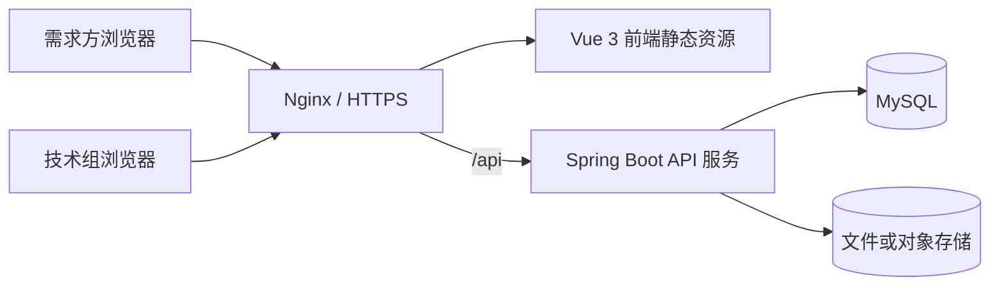

# 计算机技术组外包需求管理系统需求文档

> 文档版本：V1.1
> 项目阶段：M5 已完成，进入 M6 测试与上线准备
> 适用对象：产品负责人、前端开发、后端开发、测试人员、技术组管理员  
> 编写日期：2026-07-30
> 阶段更新：2026-08-17

---

## 1. 项目概述

### 1.1 项目背景

大学计算机技术组通常通过群聊、私信或在线表格接收网站开发、程序调试、数据处理、设备维护等技术需求。现有方式容易出现信息不完整、负责人不明确、处理状态无法追踪、历史记录难以统计等问题。

本项目建设一个轻量的技术需求管理平台，使需求方能够标准化提交需求，技术组成员能够评估、认领和更新处理进度，管理员能够管理人员与需求全流程。

### 1.2 建设目标

- 通过结构化表单收集完整需求，减少反复沟通。
- 提供统一的评估、分配、处理、验收流程。
- 让需求方随时查看当前进度、负责人和处理记录。
- 为管理员提供基础的成员、需求和数据统计能力。
- 优先保证易开发、易部署、易维护，不引入不必要的复杂架构。

### 1.3 本期暂时不包含

- 在线支付、合同签署、发票管理。
- 即时聊天、音视频会议、复杂工单 SLA。
- 多学校、多组织租户隔离。
- 自动报价、AI 自动评估、复杂绩效结算。
- 原生移动端 App；首期仅提供响应式网页。

---

## 2. 用户角色与权限

| 角色 | 主要对象 | 核心权限 |
|---|---|---|
| 需求方 | 校内师生、社团或其他授权用户 | 注册/登录、创建需求、保存草稿、补充资料、查看本人需求进度、确认验收、取消未开始的需求 |
| 技术组成员 | 承接和处理需求的学生成员 | 查看待评估需求、提交评估、认领或接受分配、更新进度、填写工作记录、提交交付物 |
| 管理员 | 组长、项目负责人 | 拥有成员权限；管理成员、分配需求、调整状态、查看全部需求、查看统计数据、维护分类和系统配置 |

### 2.1 权限边界

- 需求方只能查看和操作自己创建的需求。
- 技术组成员可查看已提交的需求，但需求方的手机号、邮箱等敏感信息仅对相关负责人和管理员展示。
- 普通成员只能更新自己负责或参与的需求。
- 管理员可以分配负责人、变更成员角色和处理异常状态。
- 关键操作必须记录操作人、时间、原状态和新状态。

---

## 3. 核心业务流程



### 3.1 典型使用场景

1. 需求方登录系统，填写“开发社团报名网站”的目标、功能、截止时间和参考附件。
2. 技术组成员在待评估列表中查看需求，判断技术可行性、工作量和主要风险。
3. 管理员确认承接并分配负责人，系统向需求方展示“已受理”。
4. 负责人按阶段更新进度，并留下可被需求方查看的进度说明。
5. 负责人上传交付链接或文件，需求方确认验收后，需求进入已完成状态。

---

## 4. 产品范围与优先级

| 模块 | P0 必须实现 | 后续增强（P1/P2） |
|---|---|---|
| 账号 | 账号密码登录、退出、修改密码、角色鉴权 | 校园统一认证、邮箱验证码、找回密码 |
| 需求提交 | 表单、草稿、附件、提交、详情查看 | 表单模板、需求复制、批量导入 |
| 需求评估 | 可行/补充资料/不承接、评估说明、工期估计 | 多人会签、评分模型、自动推荐成员 |
| 任务处理 | 分配负责人、状态更新、进度记录、交付与验收 | 子任务、工时、甘特图、版本管理 |
| 查询统计 | 列表筛选、进度查看、基础数量统计 | 报表导出、趋势分析、成员负载分析 |
| 通知 | 站内消息或页面提醒 | 邮件、短信、企业微信/飞书通知 |
| 管理 | 成员启停用、角色设置、需求分类维护 | 权限自定义、系统参数配置 |

---

## 5. 功能需求

### 5.1 登录与账号

#### 5.1.1 登录

- 用户使用账号和密码登录。
- 登录成功后按角色进入对应首页。
- 连续登录失败 5 次后，账号锁定 15 分钟。
- 登录状态过期后跳转登录页，并保留原目标地址。
- 支持主动退出，退出后立即失效当前会话。

#### 5.1.2 账号来源

- P0 推荐由管理员创建技术组成员账号。
- 需求方可开放自助注册；若项目仅面向校内，可限制学校邮箱后缀。
- 注册字段：姓名/称呼、账号、邮箱、手机号（可选）、密码、所属院系/组织（可选）。

#### 5.1.3 密码规则

- 长度至少 8 位，必须包含字母和数字。
- 后端仅保存密码哈希，不保存明文密码。
- 修改密码后使其他已登录会话失效。

### 5.2 需求提交

#### 5.2.1 需求表单字段

| 字段 | 类型 | 必填 | 规则/说明 |
|---|---|---:|---|
| 需求标题 | 单行文本 | 是 | 5～80 个字符，准确概括任务 |
| 需求分类 | 下拉单选 | 是 | 网站开发、程序开发、数据处理、技术咨询、设备/网络、其他 |
| 需求背景 | 多行文本 | 是 | 说明为什么需要此任务，20～1000 字 |
| 具体需求 | 多行文本 | 是 | 列出功能、输入输出和使用场景，50～5000 字 |
| 期望成果 | 多行文本 | 是 | 如源码、部署网站、分析报告、修复说明等 |
| 期望完成时间 | 日期 | 是 | 不早于当前日期；紧急需求需额外说明 |
| 紧急程度 | 单选 | 是 | 一般、较急、紧急；仅用于排序，不代表承诺工期 |
| 预算范围 | 单选/金额 | 否 | 无预算、待沟通或金额区间；由团队决定是否启用 |
| 技术限制 | 多行文本 | 否 | 指定语言、平台、服务器环境等 |
| 参考资料 | 链接列表 | 否 | 原型、示例站点、文档等，校验 URL 格式 |
| 附件 | 文件上传 | 否 | 单文件不超过 20 MB，最多 5 个；限制高风险文件类型 |
| 联系方式 | 文本 | 是 | 默认带入账号信息，可按权限隐藏 |
| 信息确认 | 复选框 | 是 | 确认内容真实且附件不包含违规或无授权数据 |

#### 5.2.2 表单行为

- 支持手动保存草稿；离开未保存页面时给出提示。
- 提交前进行前后端双重校验，并展示明确的字段错误。
- 提交成功后生成唯一需求编号，例如 `REQ-20260730-0001`。
- 已提交需求不可直接修改核心字段；评估要求补充时，可在保留历史记录的前提下追加或修订。
- 需求方可取消“待评估、待补充、待分配”状态的需求；进入处理中后需联系负责人或管理员。

### 5.3 需求列表与详情

#### 5.3.1 需求方视角

- 首页展示本人需求总数，以及待评估、处理中、待验收、已完成数量。
- 列表支持按编号/标题搜索，按状态、分类、提交时间筛选。
- 详情页展示需求内容、当前状态、负责人公开信息、预计完成时间和进度时间线。
- 仅“对需求方可见”的评估说明与进度记录能够被需求方查看。

#### 5.3.2 技术组视角

- 工作台展示待评估、待分配、我负责、我参与、待验收和逾期需求。
- 默认优先显示紧急、临近截止时间和长时间未处理的需求。
- 列表字段包括编号、标题、分类、紧急程度、状态、提交时间、期望完成时间、负责人。
- 支持组合筛选和分页，MVP 不要求复杂全文检索。

### 5.4 可行性评估

技术组成员在需求详情页填写评估表：

| 字段 | 必填 | 内容 |
|---|---:|---|
| 评估结论 | 是 | 可承接、需补充资料、暂不承接 |
| 评估说明 | 是 | 给出结论依据；对需求方可见 |
| 技术方案摘要 | 可承接时必填 | 拟采用的实现方式，不要求完整设计文档 |
| 预计工作量 | 可承接时必填 | 人时或人日 |
| 预计完成时间 | 可承接时必填 | 不晚于实际可承诺时间 |
| 所需技能 | 否 | 如前端、Java、Python、运维 |
| 风险与依赖 | 否 | 数据、账号、服务器、第三方接口等 |
| 内部备注 | 否 | 仅技术组成员可见 |

处理规则：

- “需补充资料”必须填写具体问题，状态变为“待补充”。
- “暂不承接”必须说明原因，由管理员确认后结束需求。
- “可承接”后进入待分配状态，可由管理员分配或授权成员认领。
- 同一需求允许重新评估，但需要保留各版本评估记录。

### 5.5 分配与协作

- 每个需求必须有一名主负责人，可以有多名参与成员。
- 管理员可分配、转交或移除负责人；普通成员可申请认领。
- 成员列表应显示技能标签和当前进行中需求数，辅助管理员分配。
- 负责人变更时记录原因和历史负责人。
- P0 仅提供需求级协作，不拆分子任务。

### 5.6 进度更新与处理记录

- 主负责人可更新进度百分比，取值为 0～100。
- 每次更新必须填写简短说明，可选填写下一步计划和预计更新时间。
- 进度记录分为“需求方可见”和“仅内部可见”。
- 状态变更、负责人变更、评估、补充资料、交付、验收均自动进入时间线。
- 处理中需求建议至少每 7 天更新一次；超过时间未更新时在工作台标记“待跟进”。
- 进度百分比仅用于表达完成程度，不自动驱动业务状态。

### 5.7 交付与验收

- 负责人提交交付说明、交付链接或附件，并将状态改为“待验收”。
- 需求方可以：
  - 验收通过：填写可选评价，需求状态变为“已完成”。
  - 验收不通过：必须说明问题，需求退回“处理中”。
- 管理员可处理长期无反馈的需求；建议线下确认后再代为关闭，并保留操作记录。
- 已完成需求默认只读；重新开启需要管理员填写原因。

### 5.8 管理功能

- 成员管理：新增、编辑、启用/停用账号，设置角色、技能标签。
- 分类管理：新增、排序、停用需求分类；已有历史数据不被删除。
- 需求管理：查看全部需求、分配负责人、调整异常状态、归档需求。
- 数据概览：按状态和分类统计数量，显示本月新增数、完成数、平均首次响应时间。
- 审计记录：查询关键操作，不提供手工修改或删除入口。

---

## 6. 状态设计



| 状态代码 | 页面名称 | 含义 | 允许的主要操作 |
|---|---|---|---|
| `DRAFT` | 草稿 | 尚未提交 | 编辑、删除、提交 |
| `PENDING_REVIEW` | 待评估 | 等待技术组判断 | 评估、取消 |
| `NEED_MORE_INFO` | 待补充 | 需要需求方补充信息 | 补充、重新提交、取消 |
| `PENDING_ASSIGNMENT` | 待分配 | 已确认可承接 | 分配、认领、取消 |
| `IN_PROGRESS` | 处理中 | 已开始执行 | 更新进度、提交交付 |
| `PENDING_ACCEPTANCE` | 待验收 | 等待需求方验收 | 通过、退回 |
| `COMPLETED` | 已完成 | 已通过验收 | 查看、评价 |
| `REJECTED` | 已驳回 | 技术组不承接 | 查看原因 |
| `CANCELLED` | 已取消 | 需求已撤销 | 查看 |

---

## 7. 页面与交互设计

### 7.1 页面清单

| 页面 | 路由建议 | 使用角色 | 主要内容 |
|---|---|---|---|
| 登录 | `/login` | 全部 | 账号、密码、登录、注册入口 |
| 注册 | `/register` | 需求方 | 基本资料与账号创建 |
| 角色化首页 | `/dashboard` | 全部已登录角色 | 状态指标、最近需求、快捷提交或处理概览 |
| 新建需求 | `/requests/new` | 需求方/管理员 | 分组表单、草稿保存、附件上传 |
| 编辑需求 | `/requests/:id/edit` | 需求方/管理员 | 编辑仍允许修改的需求或草稿 |
| 我的需求 | `/requests` | 需求方 | 搜索、筛选、分页、状态标签 |
| 需求池 | `/requests` | 成员/管理员 | 全量列表、组合筛选、详情入口 |
| 需求详情 | `/requests/:id` | 按权限 | 基本信息、评估、成员、进度时间线、操作区 |
| 技术组工作台 | `/workspace` | 成员/管理员 | 待办统计、待评估、我的任务、逾期提醒 |
| 成员管理 | `/admin/members` | 管理员 | 账号、角色、技能、启停用 |
| 分类管理 | `/admin/categories` | 管理员 | 分类增改、排序、启停用 |
| 数据概览 | `/admin/statistics` | 管理员 | 数量、趋势、响应时间 |
| 审计记录 | `/admin/audit-logs` | 管理员 | 按操作者、动作和时间查询审计记录 |
| 通知中心 | `/notifications` | 全部已登录角色 | 查看通知、标记已读并跳转关联需求 |
| 个人设置 | `/settings` | 全部 | 基本信息、修改密码 |

### 7.2 需求详情页线框示意



### 7.3 交互规范

- 桌面端内容区最大宽度建议 1200～1440 px；移动端使用单栏布局。
- 状态颜色保持统一：灰色为草稿/取消，蓝色为待处理，橙色为需补充/待验收，绿色为完成，红色为驳回/逾期。
- 删除、取消、驳回、强制改状态等不可逆或影响较大的操作必须二次确认。
- 提交过程中禁用重复点击，并提供加载、成功和失败反馈。
- 空列表需提供原因和下一步操作，例如“暂时没有需求，去提交一个需求”。
- 所有时间统一由后端保存为 UTC，前端按用户所在时区显示。

---

## 8. 信息架构与数据模型



### 8.1 数据要求

- 所有业务表包含创建时间和更新时间；重要记录建议使用逻辑删除。
- `request_no`、账号、邮箱等字段建立唯一索引。
- 需求列表常用筛选字段（状态、分类、创建人、负责人、时间）建立索引。
- 附件表仅保存元数据和存储地址，不直接保存大文件二进制。
- 需求正文、附件、日志的可见范围必须由后端校验，不能只依赖前端隐藏。

---

## 9. 后端接口需求

接口统一前缀建议为 `/api/v1`，返回 JSON；成功响应包含 `data`，失败响应包含稳定的错误码和可读消息。

| 模块 | 方法与路径 | 说明 |
|---|---|---|
| 认证 | `POST /auth/login` | 登录并创建会话 |
| 认证 | `POST /auth/logout` | 退出登录 |
| 认证 | `GET /auth/me` | 获取当前用户和权限 |
| 账号 | `POST /users/register` | 需求方注册，可按部署配置关闭 |
| 账号 | `PATCH /users/me` | 修改个人资料 |
| 需求 | `POST /requests` | 新建草稿或直接提交 |
| 需求 | `GET /requests` | 按权限查询需求列表 |
| 需求 | `GET /requests/:id` | 获取需求详情 |
| 需求 | `PATCH /requests/:id` | 编辑允许修改的需求字段 |
| 需求 | `POST /requests/:id/submit` | 提交草稿或补充后的需求 |
| 需求 | `POST /requests/:id/cancel` | 取消需求 |
| 评估 | `POST /requests/:id/evaluations` | 新增一次评估 |
| 分配 | `PUT /requests/:id/members` | 设置负责人和参与成员 |
| 进度 | `POST /requests/:id/progress` | 添加进度记录 |
| 交付 | `POST /requests/:id/deliveries` | 提交交付信息并进入待验收 |
| 验收 | `POST /requests/:id/acceptance` | 验收通过或退回 |
| 附件 | `POST /files` | 上传附件并返回文件标识 |
| 附件 | `GET /files/:id/download` | 权限校验后下载 |
| 管理 | `GET /admin/statistics` | 获取基础统计 |
| 管理 | `GET/POST/PATCH /admin/users` | 管理成员账号 |
| 管理 | `GET/POST/PATCH /admin/categories` | 管理需求分类 |

### 9.1 通用接口约定

- 列表参数：`page`、`pageSize`、`keyword`、`status`、`categoryId`、`sort`。
- 分页返回：记录列表、总条数、当前页、每页条数。
- 写接口校验 `Content-Type`、字段类型、长度和权限。
- 状态变更接口应校验当前状态，避免并发操作覆盖；建议使用数据库事务。
- 对外错误信息不暴露数据库结构、服务器路径和调用栈。

---

## 10. 推荐技术方案

### 10.1 技术选型

| 层级 | 推荐方案 | 选择原因 |
|---|---|---|
| 前端 | Vue 3 + TypeScript + Vite | 学习资料充足，开发体验轻量，适合表单和管理后台 |
| UI | Element Plus + Lucide Vue | 使用成熟业务组件和统一的线性图标 |
| 状态与路由 | Pinia + Vue Router | Vue 官方常用组合，足够支撑本项目 |
| 请求与契约 | Axios + OpenAPI/TypeScript 类型 | 请求统一封装，接口契约独立维护 |
| 后端 | Spring Boot 3 + MyBatis-Plus | 与现有 Java 技术基线一致 |
| 数据库访问 | MyBatis-Plus + Flyway | 统一 CRUD 能力并对结构变更做版本管理 |
| 数据库 | MySQL 8 | 开发、测试和生产保持同类数据库 |
| 认证 | Spring Security + 服务端会话 + HttpOnly Cookie | 页面脚本不直接保存认证令牌 |
| 文件存储 | 本地私有目录（开发）/ Docker 私有卷（部署） | 通过鉴权接口访问，后续可迁移到对象存储 |
| 部署 | Docker Compose + Nginx | 可一次启动前端、后端、数据库，便于校园服务器部署 |

> 已有 Java 基础

### 10.2 系统架构



### 10.3 建议目录结构

```text
project/
├─ frontend/                # Vue 前端
│  └─ src/
│     ├─ api/
│     ├─ components/
│     ├─ layouts/
│     ├─ router/
│     ├─ stores/
│     ├─ styles/
│     ├─ types/
│     └─ views/
├─ backend/                 # Spring Boot 后端
│  └─ src/
│     ├─ main/java/         # 业务模块、配置与安全
│     ├─ main/resources/    # 配置、Mapper 与 Flyway 迁移
│     └─ test/java/         # 后端自动化测试
├─ docs/
├─ deploy/
├─ docker-compose.yml
└─ README.md
```

---

## 11. 非功能需求

### 11.1 性能

- 常规页面在校园网正常环境下首屏加载目标不超过 3 秒。
- 列表和详情接口在 1 万条需求数据规模下，95% 请求响应时间目标不超过 800 ms。
- 默认每页 20 条，单页最多 100 条。
- 附件上传显示进度，并限制数量、大小和超时时间。

### 11.2 安全

- 全站使用 HTTPS；生产环境禁止使用默认密钥和弱密码。
- 密码使用 Argon2 或 bcrypt 哈希，日志中不得记录密码和完整令牌。
- Cookie 设置 `HttpOnly`、`Secure`、`SameSite`；使用会话时应防护 CSRF。
- 所有接口执行身份认证、角色鉴权和资源归属校验。
- 防止 SQL 注入、XSS、越权下载、恶意文件上传和暴力登录。
- 上传文件使用随机存储名，禁止直接执行；下载必须经过权限检查。
- 对登录、上传、提交等接口配置限流。
- 数据库每日备份，至少保留最近 7 天；定期验证恢复流程。

### 11.3 可用性与兼容性

- 支持当前主流 Chrome、Edge、Firefox 的最近两个稳定版本。
- 适配桌面端和手机浏览器，最小支持宽度 360 px。
- 表单标签、错误提示和按钮文案明确；不可只用颜色表达状态。
- 服务器错误应展示友好提示和可追踪的请求编号。

### 11.4 可维护性

- 前后端启用 TypeScript 严格模式、代码格式化和静态检查。
- 环境变量区分开发、测试、生产，不提交真实密钥。
- 数据库结构通过迁移文件管理。
- 核心状态流转、权限校验和需求提交应有自动化测试。

---

## 12. 验收标准

### 12.1 账号与权限

- 正确账号可登录，错误密码不可登录，退出后旧会话不可继续访问。
- 需求方无法查看其他需求方的非公开需求。
- 普通成员无法访问成员管理页面或调用管理员接口。

### 12.2 需求提交

- 需求方可以保存草稿、继续编辑并成功提交。
- 必填字段缺失或附件不合规时，系统阻止提交并准确提示。
- 提交后生成唯一编号，需求出现在需求方列表和技术组待评估列表。

### 12.3 评估与处理

- 成员能选择三种评估结论，系统按规则进入正确状态。
- 可承接需求可分配负责人，负责人能更新状态和进度记录。
- 每次关键操作都能在时间线和审计记录中追溯。

### 12.4 进度与验收

- 需求方能查看当前状态、负责人、公开进度和预计完成时间。
- 负责人提交交付后，需求进入待验收；验收不通过可退回处理中。
- 验收通过后需求进入已完成，普通用户不能再修改核心数据。

### 12.5 管理与稳定性

- 管理员可启停成员、配置分类、筛选全部需求并查看基础统计。
- 常见异常（网络失败、重复提交、会话过期、附件失败）均有明确提示，且不会产生重复业务数据。

---

## 13. 测试重点

| 测试类型 | 重点内容 |
|---|---|
| 单元测试 | 状态流转、表单校验、权限判断、编号生成 |
| 接口测试 | 登录、需求 CRUD、评估、分配、进度、验收、文件权限 |
| 页面测试 | 表单草稿、筛选分页、角色菜单、移动端布局、错误反馈 |
| 安全测试 | 越权访问、暴力登录、XSS、恶意附件、令牌过期 |
| 并发测试 | 多人同时评估/分配、重复提交、状态版本冲突 |
| 恢复测试 | 数据库备份还原、文件丢失告警、服务重启后会话行为 |

---

## 14. 实施计划建议

按 2～4 名学生开发、每周有固定课余时间估算，P0 可拆为 4 个阶段：

| 阶段 | 建议周期 | 交付内容 |
|---|---:|---|
| 需求与设计 | 1 周 | 确认字段、状态、权限、页面原型和数据模型 |
| 基础开发 | 1～2 周 | 登录、用户、需求表单、列表、详情、数据库迁移 |
| 流程开发 | 1～2 周 | 评估、分配、进度、交付验收、管理功能 |
| 测试与上线 | 1 周 | 权限和流程测试、响应式适配、部署、备份、使用说明 |

上线前必须准备：

- 一名系统管理员和至少一名技术组成员测试账号。
- 需求分类、成员技能标签、附件限制等初始配置。
- 域名、HTTPS 证书、数据库、文件存储和备份目录。
- 隐私说明、用户使用须知和技术组承接范围说明。

---

## 15. 风险与约束

| 风险 | 影响 | 应对方式 |
|---|---|---|
| 需求描述不清 | 反复沟通、工期失控 | 表单示例、必填字段、补充资料流程 |
| 成员能力和时间不稳定 | 无人承接或延期 | 技能标签、负载展示、管理员分配、明确预计时间 |
| 状态被随意修改 | 进度失真、责任不清 | 限制流转路径、记录操作日志、异常状态仅管理员处理 |
| 附件包含敏感数据 | 隐私与合规风险 | 上传提示、文件权限、类型限制、定期清理 |
| 项目范围持续扩大 | P0 无法按时上线 | P0/P1 分级，首期只完成需求闭环 |
| 校园服务器不稳定 | 服务或文件不可用 | 容器化部署、健康检查、数据库和附件备份 |

---

## 16. P0 完成定义

当以下闭环可以稳定运行时，可认为 P0 完成：


- 三类角色权限符合本文件定义。
- 需求从创建到完成的完整状态链路可用。
- 需求方能够准确查看处理进度和公开记录。
- 关键操作有审计记录，附件有访问权限保护。
- 系统可通过 Docker Compose 在一台常规 Linux 服务器上完成部署和备份。
