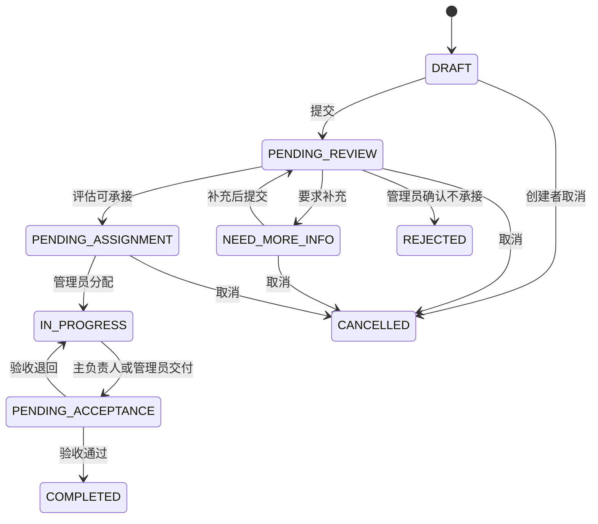

# 需求与功能说明

> 更新：2026-09-12。按当前仓库实现核对；代码已实现不等于已在生产启用或完成现场验收。

## 1. 产品定位与范围

需求协作中心服务于提出问题、跟进进度并验收成果的需求方。用户说明背景、使用场景、期待结果和时间，技术组负责评估方案与资源。页面应说明“现在发生了什么、是否需要我处理、下一步是什么”，不承诺未经确认的工期、成员能力或服务指标。

| 领域       | 当前已实现                                                                                    | 尚未实现或不在范围内                                  |
| ---------- | --------------------------------------------------------------------------------------------- | ----------------------------------------------------- |
| 账号       | 登录/退出、资料与密码修改、需求方自助注册与管理员开通、账号启停用、失败锁定、邮箱链接找回密码 | 校园统一认证、注册邮箱预激活、短信验证码              |
| 需求       | 草稿、正式提交、列表筛选、补充资料、版本冲突处理、附件、取消                                  | 离线自动保存、复制/批量导入、独立参考链接列表         |
| 评估与处理 | 三类评估结论、管理员确认驳回、负责人/参与者分配、成员推荐、进度、时间线                       | 成员自行认领、子任务、工时、甘特图                    |
| 交付       | 交付说明/链接/附件、通过或退回、交付与验收记录关联、管理员重开                                | 独立归档/删除需求功能、成果版本管理平台               |
| 管理       | 成员、需求方账号、分类、统计趋势、成员负载、CSV 导出、审计查询                                | 自定义权限、通用系统参数管理页面                      |
| 通知与运维 | 站内通知、密码恢复邮件、GHCR 发布记录、拉取部署程序、CD 邮件告警与保留程序                    | 业务全流程邮件/短信推送、持久化邮件重试、自动异机备份 |

在线支付、合同、发票、多租户、即时聊天、自动报价和原生 App 不在当前范围。

## 2. 角色与资源权限

| 操作                | REQUESTER 需求方                     | MEMBER 技术组成员              | ADMIN 管理员                       |
| ------------------- | ------------------------------------ | ------------------------------ | ---------------------------------- |
| 查看需求            | 自己创建的需求                       | 已提交的非草稿需求             | 全部需求                           |
| 创建/编辑           | 创建自己的需求；仅草稿、待补充可编辑 | 不可创建或编辑需求正文         | 可创建；资源与状态由服务层检查     |
| 查看联系方式        | 自己的需求                           | 已被分配为负责人或参与者的需求 | 可查看                             |
| 提交评估            | 不可                                 | 可对允许评估的需求操作         | 可操作，另可确认驳回               |
| 分配与推荐          | 查看公开成员信息                     | 查看成员信息，不可自行认领     | 分配一名主负责人及参与者、查看候选 |
| 更新进度/交付       | 不可                                 | 仅主负责人                     | 可在允许状态下操作                 |
| 验收                | 本人需求                             | 不可                           | 可代为验收                         |
| 账号/分类/统计/审计 | 个人设置                             | 个人设置                       | 管理入口                           |

角色判断与资源归属必须同时满足。未授权的资源访问按服务层约定返回 403 或隐藏资源的 404；隐藏按钮不构成安全边界。需求方不接收内部评估备注或内部进度内容。

## 3. 账号规则

- 账号为 3～64 字符，以字母或数字开头和结尾，中间可含点、下划线和连字符；登录对账号去除首尾空格并规范化大小写。
- 自助注册要求称呼、账号、邮箱、密码；手机号和院系/组织可选。角色固定为 REQUESTER，状态为 ACTIVE。
- 普通密码为 8～72 字符，含字母和数字，UTF-8 编码不得超过 72 字节；初始化管理员密码至少 12 字符。密码原文不自动裁剪，数据库保存 BCrypt 哈希。
- 连续登录失败默认 5 次锁定 15 分钟，生产可配置；成功登录清零失败状态。认证失败统一反馈，避免暴露账号是否存在。
- 采用服务端 Session 与 CSRF 防护，默认会话超时为 8 小时。退出使当前会话失效，改密使其他会话失效；邮箱重置使所有旧会话失效。
- 本地基础配置开放自助注册；生产默认关闭，须显式设置注册开关。邮箱后缀限制不能证明邮箱归属。
- 找回密码独立于注册开关，默认关闭。开启后通过绑定邮箱中的一次性链接验证控制权，默认有效 15 分钟，重置成功后重新登录。

具体配置与验收见[注册与登录](正式注册与登录验收清单.md)、[邮箱找回密码](邮箱找回密码部署与验收.md)。

## 4. 需求内容与提交

以下为正式提交要求，依据后端 request 模块 DTO 和服务层校验。草稿可缺少必填内容，但已填写的长度、格式、分类有效性及日期仍会校验。

| 字段                          | 正式提交要求                                                        |
| ----------------------------- | ------------------------------------------------------------------- |
| 分类 categoryId               | 必填、有效且可用；分类由管理后台维护                                |
| 标题 title                    | 5～80 字符                                                          |
| 背景 background               | 20～1000 字符                                                       |
| 具体需求 description          | 50～5000 字符                                                       |
| 期望成果 expectedResult       | 5～3000 字符                                                        |
| 期望完成日期 expectedDeadline | 必填，不早于业务时区 Asia/Shanghai 的当天                           |
| 紧急程度 urgency              | 必填，NORMAL / HIGH / URGENT；不等于工期承诺                        |
| 预算金额 budgetAmount         | 可选，非负，整数最多 10 位、小数最多 2 位                           |
| 预算说明 budgetDescription    | 可选，最多 120 字符                                                 |
| 技术限制 technicalConstraints | 可选，最多 5000 字符                                                |
| 联系方式 contactInfo          | 必填，最多 255 字符，按资源权限展示                                 |
| 信息确认 informationConfirmed | 正式提交必须为 true                                                 |
| 附件                          | 可选，单文件最多 20 MiB、数量上限 5；按上传用途和服务端类型规则校验 |

参考网址可以写入说明，当前没有独立的参考链接数组字段。需求编号由后端生成；草稿可以没有编号，提交后生成唯一编号。

保存草稿、更新内容与正式提交是不同动作。补充资料单独保存后仍为待补充，提交成功才回到待评估。更新与提交携带服务端版本；保存成功后前端立即保存新版本，即使下一步提交失败也不退回旧版本。409 时保留输入、阻止继续覆盖并引导核对最新详情。请求超时不能认定服务器回滚；新建结果不明时先查看列表，当前没有服务端创建幂等键。

## 5. 状态与操作

| 状态               | 页面名称 | 主要操作                                           |
| ------------------ | -------- | -------------------------------------------------- |
| DRAFT              | 草稿     | 创建者编辑、提交、取消；无独立删除接口             |
| PENDING_REVIEW     | 待评估   | 技术组评估，创建者可取消                           |
| NEED_MORE_INFO     | 待补充   | 创建者按最新公开要求编辑并提交，也可取消           |
| PENDING_ASSIGNMENT | 待分配   | 管理员安排负责人及参与者，创建者可取消             |
| IN_PROGRESS        | 处理中   | 主负责人或管理员更新进度、提交交付物；管理员可转交 |
| PENDING_ACCEPTANCE | 待验收   | 创建者或管理员通过/退回最新交付                    |
| COMPLETED          | 已完成   | 查看历史，管理员可按规则重开                       |
| REJECTED           | 已驳回   | 查看原因，管理员可重开至待评估                     |
| CANCELLED          | 已取消   | 查看历史，管理员按取消前状态等条件重开             |

管理员另可取消上述五种非草稿进行中状态的需求。重开目标由服务端根据原状态、取消历史及有效负责人决定，不接受前端任意指定状态；所有异常操作都要求原因和版本校验。

## 6. 评估、协作与验收

- 评估结论为可承接、需补充、暂不承接，保留版本和公开说明。可承接需提供技术方案、工作量、预计时间；内部备注仅技术组可见。
- 普通成员提交不承接结论后由管理员确认驳回；不能把提交结论等同于需求已经终止。
- 管理员在待分配或处理中安排一名主负责人，最多 20 名参与者。分配成功进入/保持处理中，需填写原因并校验版本、账号状态及角色。
- 推荐仅管理员可用，按最新可承接评估的技能匹配、分配后负载及稳定顺序展示前三名候选；点击只带入表单，不自动分配。
- 主负责人或管理员在处理中更新 0～100 的进度，填写说明并选择对外或内部可见。百分比不自动改变状态；工作台提供跟进和逾期信息。
- 交付由主负责人或管理员提交，绑定说明、可选链接/附件并进入待验收。验收针对最新交付，一份交付不能重复验收；退回须说明问题。
- 状态、评估、补充、分配、进度、交付和验收记录用于追踪过程；关键写入与审计在事务中保持一致。

## 7. 页面、接口与数据入口

完整页面表见[前端实现说明](前端实现说明.md)。以下为 API 导航，不替代 DTO 的详细契约；前缀为 `/api/v1`。

| 领域       | 接口入口                                                                                                                                 |
| ---------- | ---------------------------------------------------------------------------------------------------------------------------------------- |
| 会话       | GET /auth/csrf、POST /auth/login、POST /auth/logout、GET /auth/me                                                                        |
| 注册       | GET /users/registration、POST /users/register                                                                                            |
| 找回密码   | GET /auth/password-recovery、POST /auth/password-recovery/requests、POST /auth/password-recovery/reset                                   |
| 个人资料   | GET/PATCH /users/me、PUT /users/me/password                                                                                              |
| 需求       | GET/POST /requests、POST /requests/drafts、GET/PUT /requests/{id}、POST /requests/{id}/submit、POST /requests/{id}/cancel                |
| 评估       | GET/POST /requests/{id}/evaluations、POST /requests/{id}/evaluations/{evaluationId}/confirm-rejection                                    |
| 分配       | GET/PUT /requests/{id}/members、GET /requests/{id}/members/recommendations、GET /members/options                                         |
| 进度与交付 | GET/POST /requests/{id}/progress、GET /requests/{id}/delivery-acceptance、POST /requests/{id}/deliveries、POST /requests/{id}/acceptance |
| 附件       | GET/POST /requests/{id}/attachments、DELETE /requests/{id}/attachments/{attachmentId}、GET /files/{id}/download                          |
| 通知       | GET /notifications、GET /notifications/unread-count、POST /notifications/{id}/read、POST /notifications/read-all                         |
| 管理       | /admin/members、/admin/requesters、/admin/categories、/admin/skill-tags、GET /admin/statistics、GET /admin/audit-logs                    |
| 异常处置   | POST /admin/requests/{id}/cancel、POST /admin/requests/{id}/reopen                                                                       |

开发环境 OpenAPI 为 `/v3/api-docs`，生产默认关闭。主键在响应中以字符串表示；成功结构为 `{ data, requestId }`，错误为 `{ error: { code, message, details }, requestId }`。

数据库以 [Flyway 迁移目录](../backend/src/main/resources/db/migration/)为准：V1 建表、V2 默认数据、V3 分配约束、V4 交付验收关联、V5 统计索引、V6 审计索引、V7 草稿支持、V8 密码恢复。概念模型包含用户、分类、需求、内容修订、成员关系、评估、进度、状态历史、附件、交付、验收、通知、审计及会话/密码恢复数据；不在文档重复一份容易漂移的建表 SQL。

## 8. 统计、质量与验收

统计支持日期和分类筛选、数量与状态分布、趋势、响应指标及在岗成员负载；草稿不进入已提交需求统计。负载以主负责人关系统计，参与者数量不作为同一口径的负载；CSV 导出当前查询结果并包含统计口径，防止公式注入。字段和精确边界以 statistics 模块查询及返回的 range 为准。

验收至少覆盖完整闭环、三角色越权、重复操作、版本冲突、附件权限、公开/内部信息隔离、账号停用与会话失效、手机和键盘操作。性能容量、正式上线、邮件送达、备份恢复和 CD 启用状态需要对应环境证据，不能由代码或单元测试推断。

可重复执行的清单见[项目流程书](项目流程书.md)和[需求提交与补充资料可靠性验收](P1需求提交与补充资料可靠性验收清单.md)；后续需求应单独记录范围、负责人和验收条件，不继续沿用已过期的 M1～M7 排期。
