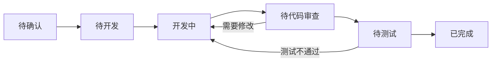
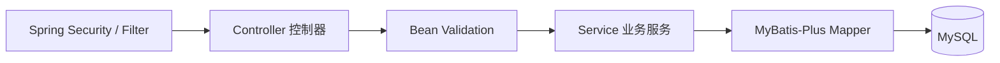
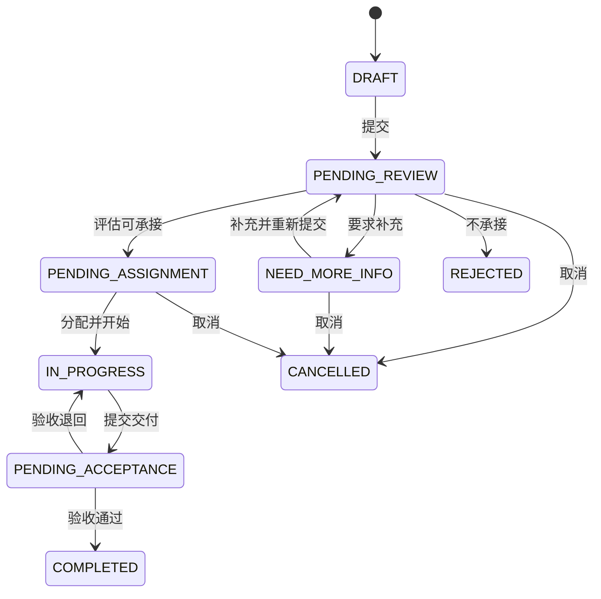
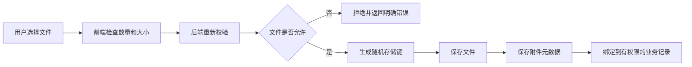
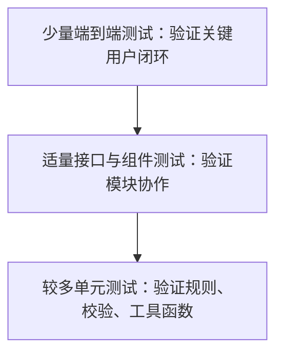
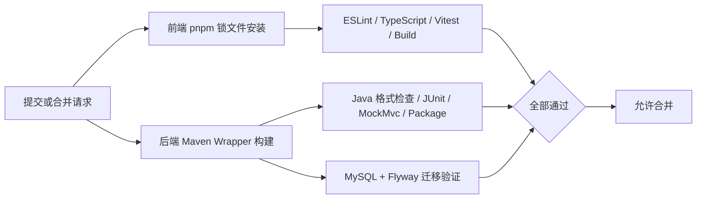

# 计算机技术组外包需求管理系统项目开发规范

> 文档版本：V1.1  
> 适用项目：计算机技术组外包需求管理系统  
> 需求基线：《计算机技术组外包需求管理系统需求文档》V1.0  
> 适用人员：零基础或初级开发者、学生项目负责人、测试与运维人员  
> 技术基线：Vue 3 + TypeScript + Spring Boot 3 + MyBatis-Plus + MySQL 8  
> 编写日期：2026-07-30

---

## 0. 如何使用本规范

本规范是项目日常开发的执行手册。它回答的不是“系统要做什么”，而是“代码、数据、接口、测试和发布应该怎样做”。

与其他文档的关系：

| 文档 | 解决的问题 |
|---|---|
| 需求文档 | 系统需要哪些功能、角色、字段和业务规则 |
| 项目流程书 | 项目按什么阶段和模块顺序推进 |
| 本开发规范 | 每个人写代码、提交代码、测试和上线时必须遵守什么规则 |

当文档之间出现冲突时，按以下优先顺序处理：

1. 已确认的最新业务需求和验收标准。
2. 数据安全、访问权限和法律合规要求。
3. 本项目统一的技术设计与本规范。
4. 个人编码习惯。

### 0.1 规则级别

- **必须**：不遵守会导致错误、安全问题或团队无法协作，代码不得合并。
- **应该**：通常应遵守；确有特殊原因时，在代码审查中说明。
- **建议**：用于提升质量，可根据实际时间选择。

### 0.2 新手遇到不懂内容时

1. 先确认自己要完成的任务和验收标准，不急着写代码。
2. 在项目内搜索已有的相似实现，优先保持一致。
3. 查看官方文档或询问负责人，不复制来源不明的整段代码。
4. 将大问题拆成可验证的小步骤，每完成一步就运行和测试。
5. 无法解释一段代码的作用时，不应直接提交它。

### 0.3 V1.1 技术基线说明

- 前端保持 Vue 3 + TypeScript + Vite + Element Plus。
- 后端固定为 JDK 21 + Spring Boot 3 + MyBatis-Plus，不再使用旧版 TypeScript 后端方案。
- 前端依赖由 pnpm 管理，后端依赖由 Maven Wrapper 管理。
- 数据库统一使用 MySQL 8，结构变更统一使用 Flyway SQL 迁移。
- 前后端通过 OpenAPI 契约同步，不共享 TypeScript 后端类型源码。

---

## 1. 项目基本原则

### 1.1 十条必须遵守的原则

1. **先确认需求，再写代码。** 不清楚输入、输出、权限和状态时先提问。
2. **一次只完成一个明确任务。** 不在修复登录问题时顺便重写需求列表。
3. **前端隐藏不等于安全。** 所有权限必须由后端再次验证。
4. **数据结构变更必须使用迁移。** 不手工修改生产数据库表结构。
5. **密码和密钥不得进入代码仓库。** 统一通过环境变量配置。
6. **错误必须被处理。** 不允许空的 `catch`，也不向用户暴露调用栈。
7. **状态只能按规则流转。** 不允许任意字符串直接更新需求状态。
8. **每个功能都要验证。** 至少覆盖正常流程、错误输入和无权限场景。
9. **代码先审查再合并。** 自己能运行不代表不会影响其他模块。
10. **上线前必须可备份、可回滚。** 没有恢复方案的发布不执行。

### 1.2 项目架构原则

- 使用单体前后端分离架构，暂不使用微服务。
- 前端、后端、文档和部署配置放在同一仓库，统一版本管理。
- 前后端通过 OpenAPI 和 DTO/TypeScript 接口约定同步数据结构，不直接共享某一种语言的源码。
- 业务规则放在后端服务层，页面只负责展示和发起操作。
- 数据库作为业务事实来源，不使用浏览器状态代替数据库状态。
- 优先使用成熟组件和简单方案，不为可能永远不会出现的需求过度设计。
- 先保证需求提交到验收的完整闭环，再添加增强功能。

---

## 2. 技术栈与固定选择

为减少零经验开发者的选择成本，本项目固定以下方案。除非项目负责人组织评审，不随意更换。

| 用途 | 固定方案 | 说明 |
|---|---|---|
| 前端运行环境 | 项目锁定的 Node.js LTS | 只用于前端工具链，由版本文件固定 |
| 前端包管理器 | pnpm | 前端只生成 `pnpm-lock.yaml` |
| 前端框架 | Vue 3 + TypeScript | 使用组合式 API 和 `<script setup>` |
| 构建工具 | Vite | 负责开发服务器与生产构建 |
| UI 组件 | Element Plus | 表单、表格、分页、弹窗等 |
| 前端路由 | Vue Router | 页面导航与路由权限 |
| 前端状态 | Pinia | 仅存放跨页面状态 |
| HTTP 请求 | Axios | 统一在请求模块封装 |
| Java 运行环境 | JDK 21 LTS | 使用 Maven 配置和 CI 固定版本 |
| 后端框架 | Spring Boot 3 | 使用 Spring Web 构建 REST API |
| 后端构建 | Maven Wrapper | 团队统一使用仓库内的 `mvnw`/`mvnw.cmd` |
| 数据访问 | MyBatis-Plus | Mapper、分页、乐观锁和通用 CRUD 能力 |
| 参数校验 | Jakarta Bean Validation | DTO 使用标准校验注解，Controller 使用 `@Valid` |
| 安全 | Spring Security + Spring Session | 服务端会话通过 HttpOnly Cookie 传递 |
| 接口文档 | springdoc-openapi | 生成 OpenAPI 文档，作为前后端契约 |
| 数据库迁移 | Flyway | SQL 迁移进入版本管理并按顺序执行 |
| 数据库 | MySQL 8 | 开发、测试、生产保持同类数据库 |
| 前端测试 | Vitest + Vue Test Utils | 工具函数和 Vue 组件测试 |
| 后端测试 | JUnit 5 + Mockito + MockMvc | 单元、Service 和接口测试 |
| 代码质量 | ESLint + Prettier；Maven 格式/静态检查插件 | 前后端分别自动检查 |
| 部署 | Docker Compose + Nginx | 单服务器部署 |

### 2.1 不在 P0 中引入的技术

- 微服务、服务注册中心、API 网关集群。
- Kubernetes、复杂消息队列、Elasticsearch。
- Redux 等与 Vue 技术栈重复的状态方案。
- 自研 UI 组件库、自研 ORM、自研认证算法。
- 为简单站内通知引入 WebSocket；首期普通轮询或页面刷新即可。

### 2.2 版本固定

- 前端 Node.js 版本写入 `.nvmrc` 或等价版本文件，依赖由 `pnpm-lock.yaml` 固定。
- 后端 Java 版本写入 `pom.xml`，Spring Boot 和依赖版本由 Maven 依赖管理固定。
- 后端统一提交 Maven Wrapper，成员不依赖机器上的不同 Maven 版本。
- `pnpm-lock.yaml`、`pom.xml`、Maven Wrapper 和 Flyway 迁移必须提交。
- 团队成员不得随意删除锁文件、修改 Spring Boot 父版本或绕过 Maven Wrapper。
- 升级核心依赖应建立独立任务，说明原因并完整回归。

---

## 3. 开发环境规范

### 3.1 必备软件

- Git：代码版本管理。
- Node.js LTS 与 pnpm：运行和构建前端。
- JDK 21：编译和运行 Spring Boot 后端。
- Maven Wrapper：由仓库提供，通常无需额外安装 Maven。
- Docker Desktop 或 Docker Engine：运行 MySQL 和本地服务。
- IntelliJ IDEA 或支持 Java 的编辑器：开发 Spring Boot、运行测试和调试。
- VS Code 或同类编辑器：安装 ESLint、Prettier、Vue 官方语言支持插件以开发前端。
- API 调试工具：可使用 Bruno、Postman 或 VS Code REST Client，团队统一一种优先方案。

### 3.2 环境检查

首次开发前运行并确认：

```powershell
git --version
node --version
pnpm --version
java --version
.\mvnw.cmd --version
docker --version
docker compose version
```

检查结果应满足项目 README 规定的版本范围。命令不存在时先安装或修复环境，不用全局安装大量未知工具绕过问题。

### 3.3 本地启动标准顺序

1. 克隆仓库并进入项目目录。
2. 按说明创建前端 `.env.local` 和后端本地 `application-local.yml`，不得提交真实配置。
3. 在 `frontend` 目录执行 `pnpm install --frozen-lockfile`。
4. 使用 Docker Compose 启动 MySQL。
5. 在 `backend` 目录使用 `.\mvnw.cmd spring-boot:run -Dspring-boot.run.profiles=local` 启动后端；Flyway 自动执行迁移。
6. 访问 Spring Boot Actuator 健康检查和 OpenAPI 页面，确认后端、数据库连接正常。
7. 在 `frontend` 目录执行 `pnpm dev`，使用测试账号完成登录。
8. 分别运行前端检查和 `mvnw.cmd verify`，确认环境正常。

### 3.4 本地数据规范

- 使用虚构姓名、邮箱和手机号，不把真实同学信息复制到本地。
- 测试附件使用专门样例，不使用包含隐私的真实文件。
- 本地数据库可以重建，但不得连接生产数据库做开发。
- 每位开发者使用自己的本地环境文件，不互相发送包含密钥的文件。

---

## 4. 仓库与目录规范

### 4.1 推荐目录

```text
project/
├─ frontend/                        # Vue 前端
│  ├─ src/
│  │  ├─ api/                       # 接口调用与 TypeScript DTO
│  │  ├─ assets/                    # 静态资源
│  │  ├─ components/                # 可复用组件
│  │  ├─ composables/               # 可复用组合逻辑
│  │  ├─ layouts/                   # 页面布局
│  │  ├─ router/                    # 路由与守卫
│  │  ├─ stores/                    # Pinia 状态
│  │  ├─ styles/                    # 全局样式与变量
│  │  ├─ utils/                     # 无业务副作用工具
│  │  └─ views/                     # 页面
│  ├─ tests/
│  ├─ package.json
│  └─ pnpm-lock.yaml
├─ backend/                         # Spring Boot 后端
│  ├─ src/main/java/.../
│  │  ├─ common/                    # 响应、错误码、通用工具
│  │  ├─ config/                    # Spring 与 MyBatis-Plus 配置
│  │  ├─ security/                  # 认证、授权、会话
│  │  └─ modules/                   # 按业务模块组织
│  ├─ src/main/resources/
│  │  ├─ mapper/                    # 必要的 MyBatis XML
│  │  ├─ db/migration/              # Flyway SQL 迁移
│  │  └─ application.yml
│  ├─ src/test/java/.../
│  ├─ pom.xml
│  ├─ mvnw
│  └─ mvnw.cmd
├─ docs/                            # 需求、流程、接口和运维文档
├─ deploy/                          # Nginx、容器与部署配置
├─ docker-compose.yml
└─ README.md
```

### 4.2 目录规则

- 文件按职责放置，不把所有代码都放在 `utils` 或单个大文件中。
- 业务模块名称前后端尽量一致，例如都使用 `requests`、`evaluations`、`users`。
- 测试文件放在被测文件旁或统一测试目录，团队选定一种后保持一致。
- 生成物、依赖目录、日志、上传文件和本地环境文件加入 `.gitignore`。
- 不提交 `node_modules`、`dist`、`target`、测试覆盖率目录、数据库文件和编辑器个人配置。

### 4.3 后端模块内部结构

```text
modules/request/
├─ controller/RequestController.java       # HTTP 接口
├─ service/RequestService.java             # 业务接口
├─ service/impl/RequestServiceImpl.java    # 业务规则与事务
├─ mapper/RequestMapper.java               # MyBatis-Plus Mapper
├─ entity/RequestEntity.java               # 数据库实体
├─ dto/CreateRequestCommand.java           # 请求 DTO
├─ vo/RequestDetailVO.java                 # 响应对象
├─ enums/RequestStatus.java                # 业务枚举
└─ converter/RequestConverter.java         # Entity/DTO/VO 转换
```

简单模块可适当合并 DTO/VO 子目录，但 Controller 不得直接调用 Mapper，Entity 不得直接作为接口响应返回。

---

## 5. 任务与需求管理规范

### 5.1 开始编码前必须明确

- 为什么要做这个任务。
- 哪个角色使用它。
- 从哪个页面或接口进入。
- 输入数据、输出结果和错误情况。
- 涉及哪些业务状态和权限。
- 如何判断任务完成。
- 是否影响数据库、接口或已有数据。

### 5.2 任务拆分标准

一个合适的开发任务通常能在 0.5～2 个工作日内完成和验证。例如：

- 合适：“实现需求草稿创建接口及接口测试”。
- 合适：“完成我的需求列表页面并接入分页接口”。
- 过大：“完成需求管理模块”。
- 过小：“把按钮颜色改成蓝色”，除非它是独立缺陷。
- 模糊：“优化系统”“完善后端”。

### 5.3 任务状态



### 5.4 开发就绪标准（Definition of Ready）

任务进入“开发中”前应满足：

- 需求和验收标准清楚。
- 原型或页面说明可用。
- 依赖接口或数据结构已确定。
- 没有阻止开发的未决权限或状态问题。
- 负责人和预计完成时间明确。

### 5.5 完成标准（Definition of Done）

- 功能已实现并通过开发自测。
- 正常、异常和权限场景已覆盖。
- 代码通过 lint、类型检查、测试和构建。
- 已完成代码审查。
- 数据库、接口和配置变更已写入文档。
- 测试环境验证通过，没有阻断或严重缺陷。

---

## 6. Git 使用规范

### 6.1 分支模型

- `main`：稳定分支，只接收审查和测试通过的代码。
- `feature/<module>-<summary>`：新功能，例如 `feature/request-draft`。
- `fix/<module>-<summary>`：缺陷修复，例如 `fix/auth-session-expire`。
- `docs/<summary>`：纯文档修改。
- `chore/<summary>`：工具、依赖或配置维护。

分支名使用小写英文、数字和连字符，不使用空格、中文或无意义名称。

### 6.2 日常操作顺序

1. 更新本地主分支。
2. 从最新主分支创建任务分支。
3. 小步修改并随时运行检查。
4. 查看 `git diff`，确认没有密钥、调试输出或无关文件。
5. 提交清晰的 commit。
6. 推送分支并发起合并请求。
7. 根据审查意见修改，在测试通过后合并。

### 6.3 Commit 规范

格式：

```text
<type>(<scope>): <简短说明>
```

常用类型：

| 类型 | 用途 | 示例 |
|---|---|---|
| `feat` | 新功能 | `feat(request): 支持保存需求草稿` |
| `fix` | 修复缺陷 | `fix(auth): 修复退出后会话仍有效` |
| `docs` | 文档 | `docs(api): 补充登录错误码` |
| `test` | 测试 | `test(request): 增加越权访问用例` |
| `refactor` | 不改变功能的重构 | `refactor(user): 提取权限校验服务` |
| `chore` | 构建、依赖、工具 | `chore(deps): 更新补丁版本依赖` |
| `style` | 只改格式 | `style(web): 统一表单缩进` |

要求：

- 一次提交表达一个完整意图。
- 标题说明结果，不写“修改一下”“更新代码”“test”。
- 不把格式化全仓库与业务功能混在同一提交。
- 已推送且他人可能基于其开发的历史，不随意强制改写。

### 6.4 合并请求规范

合并请求必须包含：

- 改动目的和对应任务。
- 主要改动内容。
- 测试方式和结果。
- 页面改动的截图或录屏。
- 数据库迁移、环境变量、接口兼容性说明。
- 已知限制和需要审查者重点检查的地方。

禁止事项：

- 未自测就要求别人代为发现基础错误。
- 一个合并请求包含多个无关模块的大量改动。
- 为通过检查而删除测试、关闭类型检查或使用大范围忽略。
- 直接把测试环境或生产环境密钥写进代码。

---

## 7. 依赖管理规范

### 7.1 添加依赖前

必须先回答：

1. 现有依赖或标准 API 是否已经能解决问题？
2. 这个包是否仍在维护，文档是否清楚？
3. 是否引入大量间接依赖或已知安全问题？
4. 前端包是否明显增加构建体积？
5. 团队是否能理解和维护它？

### 7.2 依赖操作规则

- 前端只用 pnpm，不混用 npm 或 yarn；依赖安装到 `frontend`。
- 后端只通过 Maven Wrapper 和 `pom.xml` 管理依赖，不手工复制 JAR。
- 前端普通安装使用固定锁文件；后端依赖版本优先由 Spring Boot dependency management 管理。
- MyBatis-Plus 使用 `com.baomidou:mybatis-plus-spring-boot3-starter`，不同时引入 Boot 2 starter 或原生 MyBatis starter。
- 升级依赖单独提交，先阅读变更说明并运行前后端完整测试。
- 删除代码后同步删除不再使用的 npm 或 Maven 依赖。
- 不全局安装项目运行所需的构建依赖，避免“只在我的电脑上能运行”。

### 7.3 依赖安全

- 定期执行依赖安全检查。
- 严重漏洞先确认是否实际受影响，再升级或采取缓解措施。
- 不为消除提示盲目升级主版本。
- 来源不明、下载量极低、无人维护的包需负责人批准。
- 前端检查 `pnpm audit` 结果；后端结合 Maven 依赖树和依赖漏洞检查工具确认风险。

---

## 8. 通用编码规范

### 8.1 命名

| 对象 | 规则 | 示例 |
|---|---|---|
| 变量、函数 | `camelCase` | `requestList`、`getCurrentUser` |
| 类、组件、类型 | `PascalCase` | `RequestDetail`、`UserRole` |
| 常量 | `UPPER_SNAKE_CASE` | `MAX_FILE_SIZE` |
| 布尔值 | 使用 `is/has/can/should` 前缀 | `isLoading`、`canReview` |
| 数据库表/字段 | 统一 `snake_case` | `request_member`、`created_at` |
| 路由 | 小写复数名词和连字符 | `/api/v1/progress-logs` |
| Vue 组件文件 | `PascalCase.vue` | `RequestStatusTag.vue` |
| 普通 TS 文件 | `kebab-case.ts` 或项目选定格式 | `request-service.ts` |

名称必须说明含义。禁止使用 `data1`、`temp2`、`abc`、`handleThing` 等无法理解的名称。

### 8.2 格式

- 使用 Prettier 自动格式化，不手工争论空格和换行风格。
- 使用 ESLint 检查潜在错误。
- 文件统一 UTF-8，换行符由仓库配置统一。
- 一行只做一个清晰操作，避免多层三元表达式。
- 提交前执行项目规定的 `format`、`lint`、`typecheck`。

### 8.3 函数与文件

- 一个函数只负责一个主要动作。
- 参数过多时改用有类型的对象参数。
- 嵌套超过 3 层时考虑提前返回或拆分函数。
- 同一文件出现多个不相关职责时拆分。
- 不以固定行数机械拆分，但代码必须能被新人快速定位和测试。

正确示例：

```ts
type AssignRequestInput = {
  requestId: bigint;
  assigneeId: bigint;
  operatorId: bigint;
  reason?: string;
};

async function assignRequest(input: AssignRequestInput) {
  // 校验状态、成员和权限后，再执行事务。
}
```

不推荐示例：

```ts
async function doIt(a: any, b: any, c: any, d: any) {
  // 名称、类型和职责都不清楚。
}
```

### 8.4 注释

应该注释：

- 为什么必须这样处理。
- 不直观的业务限制和安全原因。
- 临时兼容方案的背景、负责人和移除条件。
- 正则表达式、复杂算法或外部系统限制。

不应该注释：

- 代码已经清楚表达的动作。
- 与代码不一致的旧说明。
- 大段复制需求文档。
- 没有任务编号和处理条件的永久 `TODO`。

```ts
// 已提交需求不能直接覆盖原内容，补充资料需要保留历史版本。
await createRequestRevision(input);
```

### 8.5 常量与魔法值

- 状态、角色、文件上限等统一定义，不在多处写字符串或数字。
- 前后端共享的稳定枚举放入 `packages/shared`。
- 配置型数值从配置读取，业务固定规则使用命名常量。

```ts
const MAX_UPLOAD_FILE_COUNT = 5;
const MAX_UPLOAD_FILE_SIZE_BYTES = 20 * 1024 * 1024;
```

### 8.6 时间、金额和编号

- 后端与数据库统一保存 UTC 时间。
- 前端仅在展示时转换为用户时区。
- 接口使用 ISO 8601 时间字符串，例如 `2026-07-30T14:30:00.000Z`。
- 金额不得使用浮点数直接计算，使用整数分或数据库定点数。
- 需求编号由后端生成，不能由前端猜测或拼接。
- 不使用数组序号作为数据库主键或业务编号。

### 8.7 空值约定

- `undefined` 表示调用方未提供。
- `null` 表示业务上明确为空，是否允许由接口契约决定。
- 空字符串不代替 `null`，除非字段业务上允许空文本。
- 后端写入数据库前统一规范化用户输入，例如去除首尾空格。

---

## 9. 前端 TypeScript 规范

### 9.1 必须开启严格模式

- `tsconfig` 启用 `strict`。
- 禁止为了省事关闭全局类型检查。
- 新代码禁止使用无说明的 `any`。
- 外部输入先视为 `unknown`，通过校验后再使用。

```ts
function parsePayload(payload: unknown): CreateRequestInput {
  return createRequestSchema.parse(payload);
}
```

### 9.2 类型规则

- 能从实现推断的局部变量无需重复标注。
- 公共函数、接口输入输出、组件属性必须有明确类型。
- 使用联合类型或枚举表示有限状态，不使用任意字符串。
- 不使用非空断言 `!` 掩盖可能为空的问题。
- 类型断言 `as` 只用于已经有运行时保证的情况，并说明依据。

```ts
export const REQUEST_STATUS = {
  DRAFT: 'DRAFT',
  PENDING_REVIEW: 'PENDING_REVIEW',
  IN_PROGRESS: 'IN_PROGRESS',
  COMPLETED: 'COMPLETED',
} as const;

export type RequestStatus =
  (typeof REQUEST_STATUS)[keyof typeof REQUEST_STATUS];
```

### 9.3 异步代码

- 使用 `async/await` 保持流程清晰。
- 不创建未等待、未返回、未捕获错误的 Promise。
- 并行执行互不依赖的请求，依赖结果的步骤保持顺序。
- 页面卸载或重复搜索时，应该取消或忽略过期请求结果。

---

## 10. 前端开发规范

### 10.1 页面、业务组件和基础组件

- 页面组件负责组合模块、读取路由和调用业务操作。
- 业务组件负责某个明确场景，如评估表、进度时间线。
- 基础组件负责通用显示，如状态标签、空状态、确认按钮。
- 组件不直接访问数据库，不包含后端权限规则的替代实现。
- 超过两个页面重复的 UI 或逻辑，应评估提取组件或组合函数。

### 10.2 Vue 组件结构

推荐顺序：

```vue
<script setup lang="ts">
// 1. 外部依赖
// 2. 项目模块
// 3. props / emits
// 4. 状态与计算属性
// 5. 生命周期
// 6. 事件与辅助函数
</script>

<template>
  <!-- 语义清楚的页面结构 -->
</template>

<style scoped>
/* 仅该组件需要的样式 */
</style>
```

### 10.3 Props 与事件

- Props 只读，不在子组件内直接修改。
- 事件名称表达已经发生或请求执行的动作，如 `submit`、`cancel`、`update:modelValue`。
- 避免把整个巨大对象传给只需要两个字段的组件。
- 默认值应合理，不用默认值掩盖必填数据缺失。

### 10.4 状态管理

使用优先级：

1. 仅组件使用：局部 `ref` / `reactive`。
2. 父子共享：Props 和事件。
3. 同一功能多层共享：组合函数。
4. 跨页面长期共享：Pinia。
5. 服务器数据：调用 API 获取，不长期复制到多个 Store。

适合 Pinia 的内容：当前用户、全局权限、少量系统配置。表单临时输入和某个页面的弹窗状态不放入全局 Store。

### 10.5 路由与权限

- 路由表包含页面标题和所需角色元数据。
- 路由守卫负责未登录跳转和基础页面权限提示。
- 后端仍必须对每个请求鉴权。
- 404、403 和服务器错误使用不同页面或提示。
- 登录过期时清理本地用户状态，跳转登录页并保留安全的目标地址。

### 10.6 API 调用

- 所有 Axios 调用放在 `api` 目录，不散落在组件中。
- 统一设置基础路径、超时、Cookie、错误转换和请求编号。
- API 函数名称体现业务，例如 `submitRequest`，不写 `postData`。
- 页面不依赖后端原始错误结构，由请求层转换为统一错误类型。

```ts
export async function getRequestDetail(requestId: string) {
  const response = await http.get<ApiResponse<RequestDetail>>(
    `/requests/${requestId}`,
  );
  return response.data.data;
}
```

### 10.7 表单

- 标签说明用户需要填写什么，不只依赖占位文本。
- 前端校验用于及时反馈，后端校验用于保证安全和数据正确。
- 必填、长度、格式和关联条件应与后端一致。
- 提交时禁用按钮并显示加载状态，防止重复提交。
- 提交失败时保留用户输入，不清空表单。
- 长表单支持分组和草稿保存，离开未保存页面时提醒。
- 错误信息靠近对应字段，并说明如何修正。

### 10.8 表格与列表

- 默认使用后端分页，避免一次加载全部需求。
- 筛选条件应能清除，并与查询参数保持一致。
- 加载中、无数据、无筛选结果和加载失败使用不同状态。
- 表格主要操作保持可见，低频操作收纳到更多菜单。
- 手机端避免强行压缩宽表格，改用卡片或允许合理横向滚动。

### 10.9 加载、空状态和错误状态

每个异步页面至少考虑四种状态：

```text
初始/加载中 -> 加载成功且有数据
           -> 加载成功但无数据
           -> 加载失败，可重试
```

禁止页面因数据未返回直接报错；使用可选链不能替代完整的加载状态设计。

### 10.10 样式

- 颜色、间距、圆角和字体尺寸使用统一变量。
- 优先使用 Element Plus 主题和布局能力，不重复造组件。
- 全局样式只放重置、变量和通用规则。
- 页面样式避免 `!important`，确需使用时说明原因。
- 不使用任意超大 `z-index` 解决层级问题。
- 状态不能只靠颜色区分，必须配合文字或图标。

---

## 11. 界面、可用性与无障碍规范

### 11.1 统一界面规则

- 相同状态在所有页面使用相同名称和颜色。
- 相同操作使用相同动词，例如统一使用“提交需求”，不混用“发布”“确认提交”。
- 危险操作使用明确文案，例如“取消需求”，不使用含糊的“确定”。
- 页面主操作每个区域最多一个明显主按钮。
- 操作成功给出结果，操作失败说明原因和下一步。

### 11.2 响应式

- 设计基准覆盖桌面端和最小 360 px 手机宽度。
- 表单在手机端单列展示。
- 操作按钮在窄屏下不遮挡内容，不依赖鼠标悬停。
- 主要流程必须能在触屏上完成。

### 11.3 无障碍最低要求

- 输入框有可关联的标签。
- 按钮有可理解文本或辅助说明。
- 键盘可以完成登录、填写表单和确认弹窗。
- 焦点状态可见，弹窗关闭后焦点回到触发位置。
- 图片有替代文本；装饰图标不被屏幕阅读器重复朗读。
- 文本与背景对比足够，不用浅灰小字承载重要信息。

### 11.4 日期和状态文案

- 显示绝对日期时使用统一格式，如 `2026-07-30 22:30`。
- “刚刚”“三天前”等相对时间旁建议提供完整时间。
- 技术状态代码不得直接展示给普通用户。
- 逾期、紧急等标签需有清楚定义，不能造成团队已承诺工期的误解。

---

## 12. API 设计规范

### 12.1 基础约定

- 统一前缀：`/api/v1`。
- 使用 JSON 作为常规请求和响应格式，文件上传除外。
- URL 使用资源名词，不使用动作堆叠。
- 使用正确 HTTP 方法表达操作。
- 版本发布后避免破坏已有字段含义。

### 12.2 方法约定

| 方法 | 用途 | 示例 |
|---|---|---|
| `GET` | 查询，不改变数据 | `GET /api/v1/requests/:id` |
| `POST` | 创建资源或执行明确业务动作 | `POST /api/v1/requests/:id/submit` |
| `PATCH` | 部分修改 | `PATCH /api/v1/users/me` |
| `PUT` | 整体替换或设置关系 | `PUT /api/v1/requests/:id/members` |
| `DELETE` | 删除允许删除的资源 | 草稿附件可使用 |

业务动作如提交、取消、验收可以使用子路径，因为它们包含状态规则，不等同于普通字段修改。

### 12.3 成功响应

```json
{
  "data": {
    "id": "123",
    "requestNo": "REQ-20260730-0001",
    "status": "PENDING_REVIEW"
  },
  "requestId": "req_01J..."
}
```

列表响应：

```json
{
  "data": {
    "items": [],
    "pagination": {
      "page": 1,
      "pageSize": 20,
      "total": 0,
      "totalPages": 0
    }
  },
  "requestId": "req_01J..."
}
```

### 12.4 错误响应

```json
{
  "error": {
    "code": "REQUEST_STATUS_CONFLICT",
    "message": "当前状态下不能提交交付物",
    "details": []
  },
  "requestId": "req_01J..."
}
```

要求：

- `code` 稳定，供前端判断；`message` 给用户阅读。
- 校验错误可在 `details` 中提供字段和原因。
- 不返回 SQL、文件系统路径、环境变量或调用栈。
- 所有错误包含请求编号，便于查日志。

### 12.5 HTTP 状态码

| 状态码 | 使用场景 |
|---:|---|
| 200 | 查询或普通操作成功 |
| 201 | 创建成功 |
| 204 | 成功且无需响应体 |
| 400 | 请求格式或参数错误 |
| 401 | 未登录或会话无效 |
| 403 | 已登录但无权限 |
| 404 | 资源不存在，或为安全需要隐藏资源存在性 |
| 409 | 状态冲突、重复提交、唯一值冲突 |
| 413 | 上传文件过大 |
| 429 | 请求过于频繁 |
| 500 | 未预期服务器错误 |

### 12.6 分页、筛选和排序

- 默认页码从 1 开始，默认每页 20 条，最大 100 条。
- 筛选参数使用明确名称，如 `status`、`categoryId`、`createdFrom`。
- 排序字段使用白名单，禁止直接把用户输入拼进 SQL。
- 返回总数成本过高时再考虑其他分页方式，P0 使用普通分页即可。
- 搜索词去除首尾空格并限制长度。

### 12.7 兼容性

- 新增可选响应字段通常是兼容变更。
- 删除字段、改名、改变类型或含义是破坏性变更。
- 破坏性变更应升级 API 版本，或先提供过渡期。
- 前后端同仓库不代表可以不维护接口契约。

---

## 13. 后端开发规范

### 13.1 分层职责



- Spring Security / Filter：处理会话认证、请求编号、限流和基础访问控制。
- Controller：定义 HTTP 接口，接收已校验 DTO，调用 Service，返回统一响应。
- Service：执行业务规则、资源权限、状态流转和事务，是业务逻辑的唯一入口。
- Mapper：使用 MyBatis-Plus 或 XML 执行数据访问，不决定业务是否允许。
- Entity：映射数据库表；DTO/Command 表示输入；VO 表示对外输出，三者不得混用。

### 13.2 控制器规范

- 使用 `@RestController` 和统一的 `/api/v1` 路径。
- 控制器保持薄，不注入或直接调用 Mapper。
- 使用 `@Valid`/`@Validated` 触发 DTO 校验，不手工重复基础格式校验。
- 当前用户从 Spring Security 上下文或统一用户组件读取，不接受前端传入的操作者 ID。
- 业务异常交给 `@RestControllerAdvice`，不在每个方法复制 `try/catch`。
- Controller 只负责 HTTP 语义，不编写事务、状态机和复杂对象转换。

```java
@PostMapping("/{id}/submit")
public ApiResponse<RequestDetailVO> submit(
        @PathVariable Long id,
        @AuthenticationPrincipal LoginUser loginUser) {
    return ApiResponse.success(requestService.submit(id, loginUser.id()));
}
```

### 13.3 服务层规范

服务层操作建议按以下顺序：

1. 查询目标资源。
2. 判断资源是否存在。
3. 判断操作者是否有权限。
4. 校验当前业务状态和输入条件。
5. 在事务内执行数据修改及关联记录。
6. 返回业务结果。
7. 在事务成功后触发非关键通知。

补充规则：

- Service 接口表达业务动作，如 `submitRequest`、`assignMember`，不只暴露通用 CRUD。
- 实现类使用构造器注入，禁止字段注入 `@Autowired`。
- 多步写操作使用 `@Transactional(rollbackFor = Exception.class)`。
- 不依赖同一类内部调用触发事务；Spring 代理下自调用可能绕过 `@Transactional`。
- 只读查询可使用 `@Transactional(readOnly = true)`，但不要为了形式给每个简单查询加事务。
- 事务成功前不发送不可撤回的外部通知，不在事务中执行慢文件上传。

### 13.4 输入校验

- 所有外部输入都不可信，包括路径、查询、请求体、文件名和 Cookie。
- 使用 Jakarta Bean Validation 校验类型、长度、格式和基础必填规则。
- 使用请求 DTO 接收数据，禁止 Controller 直接接收 Entity。
- `@NotBlank` 用于必填文本，`@Size` 控制长度，`@Email`/`@Pattern` 控制格式。
- 跨字段条件和状态相关条件放在 Service 或自定义校验器中。
- 对文本执行合理长度限制，避免超大请求。
- 对 URL、日期、邮箱等使用明确规则，不自行编写脆弱解析逻辑。

```java
public record CreateRequestCommand(
        @NotBlank @Size(min = 5, max = 80) String title,
        @NotNull Long categoryId,
        @NotBlank @Size(min = 50, max = 5000) String description,
        @NotNull LocalDate expectedDeadline) {
}
```

### 13.5 数据查询

- 只选择接口需要的字段，尤其避免返回密码哈希和内部备注。
- 列表必须分页，不在内存中对全部数据库记录分页。
- 避免循环内逐条查询造成 N+1 问题。
- 对可能为空的查询结果显式处理。
- 对唯一约束、外键约束等数据库错误转换为稳定业务错误。
- 简单单表查询优先使用 `LambdaQueryWrapper`/`LambdaUpdateWrapper`，避免字符串字段名。
- 多表详情或统计查询使用明确的 Mapper 方法和 XML SQL，不用大量 Java 循环拼装查询。
- 排序字段、SQL 片段和表名使用白名单；禁止把用户输入传入 `last`、`apply`、`inSql` 等原生片段。
- Controller 不直接返回 MyBatis-Plus 的 Entity 或内部 `Page` 对象，转换为稳定分页响应。

```java
LambdaQueryWrapper<RequestEntity> query = Wrappers.lambdaQuery();
query.eq(status != null, RequestEntity::getStatus, status)
     .like(StringUtils.hasText(keyword), RequestEntity::getTitle, keyword)
     .orderByDesc(RequestEntity::getCreatedAt);
```

### 13.6 事务

以下操作必须考虑事务：

- 提交需求并生成编号、写入状态历史。
- 评估并改变需求状态。
- 分配负责人并更新需求状态。
- 提交交付并写入时间线。
- 验收并改变状态、写入验收记录。

事务中只放必须原子完成的数据库操作，不在事务内进行慢文件上传或外部网络请求。

事务规则：

- 默认只对运行时异常回滚不够直观，项目统一显式写 `rollbackFor = Exception.class`。
- 捕获异常后若需要回滚，应重新抛出业务异常；禁止记录后静默继续提交。
- 事务方法保持 `public`，由其他 Spring Bean 调用。
- 涉及数据库与文件时，先保存临时文件，再在事务成功后确认绑定；失败时清理临时文件。

### 13.7 幂等与重复提交

- 前端提交时禁用按钮，但后端仍需防止重复处理。
- 对验收、取消等操作校验当前状态；相同请求重复到达时返回明确结果或冲突。
- 需求编号使用数据库唯一约束保证不重复。
- 关键创建接口可根据需要支持幂等键，但 P0 至少应有状态和唯一约束保护。

### 13.8 并发修改

- 两名成员可能同时评估或分配同一需求。
- 更新时同时校验记录 ID 和当前状态，受影响行数不符合预期时返回 409。
- 需求主表使用 `@Version` 和 MyBatis-Plus 乐观锁插件，或在更新条件中显式包含旧状态/版本号。
- 不允许后到请求静默覆盖先到请求。

### 13.9 Java 编码规范

- 包名全小写，根包统一，例如 `edu.school.techrequest`。
- 类名使用 `PascalCase`；方法和变量使用 `camelCase`；常量使用 `UPPER_SNAKE_CASE`。
- 使用 `record` 表示适合不可变的数据 DTO；Entity 按 MyBatis-Plus 映射需要设计。
- 方法参数、返回值和字段不使用含义模糊的 `Object`、`Map<String, Object>` 代替明确类型。
- 集合返回空集合，不返回 `null`；单个可能不存在的内部查询可使用 `Optional`，不要把 `Optional` 放进 Entity 字段。
- 比较枚举使用 `==`，比较字符串使用 `Objects.equals` 或明确的 `equals`。
- 金额使用 `BigDecimal`，日期使用 `LocalDate`，时间点统一使用 UTC `Instant` 或项目统一的 UTC 时间类型。
- 不直接使用 `System.out.println`，统一使用 SLF4J 日志。
- 优先构造器注入；Bean 依赖应为 `final`。
- Java 格式由 Maven 中统一配置的 Spotless 等插件执行，不依赖个人 IDE 格式设置。

### 13.10 Lombok 规范

- Lombok 不是必须依赖；若项目启用，只使用团队约定的稳定注解。
- Entity 禁止随意使用 `@Data`，避免自动生成的 `equals`、`hashCode` 和 `toString` 关联敏感字段或造成递归。
- 密码哈希、会话令牌等敏感字段不得进入自动生成的 `toString`。
- DTO 优先使用 Java `record` 或明确的不可变类。

### 13.11 MyBatis-Plus 配置

- 通过 `mybatis-plus-spring-boot3-starter` 集成，不重复引入 MyBatis starter。
- 按项目锁定的 MyBatis-Plus 版本说明显式添加分页插件所需模块，不能只在个人环境中补依赖。
- 在启动配置中统一使用 `@MapperScan` 扫描 Mapper 包，不在不同模块混用多套扫描方式。
- 统一配置分页插件；分页参数在进入 Mapper 前限制最大页大小。
- 对需要并发保护的主表启用乐观锁插件和 `@Version` 字段。
- 公共创建/更新时间可用 `MetaObjectHandler` 自动填充，但操作者 ID 仍需从当前用户明确传入。
- 逻辑删除只用于确实需要保留的可删除实体；评估、状态历史、审计日志不得提供普通删除能力。
- `BaseMapper` 和 `IService` 的通用方法不能直接暴露给 Controller；仍需经过业务 Service。
- 自定义复杂 SQL 放在有明确名称的 Mapper 方法与 XML 中，并为关键 SQL 编写集成测试。
- Entity 使用 `@TableName`、`@TableId`、`@TableField` 等注解明确非默认映射；XML 的 namespace 和方法 ID 必须与 Mapper 对应。

---

## 14. 认证与权限规范

### 14.1 认证和授权的区别

- 认证：确认“你是谁”，例如验证登录会话。
- 授权：确认“你能做什么”，例如成员能否评估该需求。
- 资源归属：确认“这条数据是不是你可以访问的”，例如需求方只能看自己的需求。

三层必须分别处理。仅判断用户已经登录不代表用户可以访问任意需求。

### 14.2 会话规则

- P0 统一使用 Spring Security 服务端会话，不同时维护 JWT 和 Session 两套认证。
- 会话 ID 仅通过 HttpOnly Cookie 传递；生产环境设置 `Secure` 和合适的 `SameSite`。
- 使用 Spring Session JDBC 时，会话存入 MySQL，满足单机重启后的会话管理和主动失效需求。
- Spring Security 配置使用 `SecurityFilterChain`，明确公开接口、登录接口和受保护接口。
- 登录成功后重新生成会话标识，防止会话固定攻击。
- 退出、修改密码、停用账号后使相关会话失效。
- 不把长期有效令牌存入 `localStorage`。
- 不在 URL 查询参数中传递令牌。
- 使用 Cookie 会话时配置 CSRF 防护；若采用前后端分离的 Cookie CSRF Token，前端需按约定回传请求头。

### 14.3 密码规则

- 使用 Argon2 或 bcrypt 保存密码哈希。
- 通过 Spring Security `PasswordEncoder` 调用成熟实现，每个密码自动使用独立盐值，不自行实现加密算法。
- 登录错误不透露账号是否存在。
- 连续失败达到限制后暂时锁定或限流。
- 日志、错误信息、测试截图均不得包含密码。
- 密码编码方案或强度升级时使用可识别的编码格式，并规划旧哈希的平滑升级。

### 14.4 权限矩阵

| 操作 | 需求方 | 成员 | 管理员 |
|---|---:|---:|---:|
| 创建需求 | 是 | 按需求方身份时可选 | 可选 |
| 查看本人需求 | 是 | 按成员数据范围 | 全部 |
| 查看内部备注 | 否 | 相关需求/按规则 | 是 |
| 提交评估 | 否 | 是 | 是 |
| 分配负责人 | 否 | 默认否 | 是 |
| 更新进度 | 否 | 负责或参与的需求 | 是 |
| 提交交付 | 否 | 主负责人 | 是 |
| 验收 | 需求创建者 | 否 | 异常代处理时可选 |
| 管理成员与分类 | 否 | 否 | 是 |

具体接口必须比此简表更严格地检查当前状态和资源关系。

### 14.5 权限失败

- 未认证返回 401。
- 已认证但角色不足返回 403。
- 对敏感资源可返回 404，避免泄露资源是否存在。
- 前端收到权限错误时显示友好说明，不自动反复重试。

---

## 15. 业务状态规范

### 15.1 状态定义

需求状态以后端 Java 枚举为业务事实来源；前端 TypeScript 联合类型必须与 OpenAPI 枚举保持一致：

```text
DRAFT
PENDING_REVIEW
NEED_MORE_INFO
PENDING_ASSIGNMENT
IN_PROGRESS
PENDING_ACCEPTANCE
COMPLETED
REJECTED
CANCELLED
```

### 15.2 状态流转



### 15.3 实现规则

- 状态不能通过普通 `PATCH` 任意修改。
- 每种业务动作调用明确的 Service 方法，如 `submitRequest`、`reviewRequest`。
- 服务函数检查操作者、当前状态、输入和目标状态。
- 状态修改和状态历史必须在同一数据库事务中完成。
- 每条历史记录包含操作人、前后状态、原因和时间。
- 管理员强制变更也必须遵守专用接口并填写原因。
- 前端根据后端返回的允许操作展示按钮，但后端仍独立校验。
- Entity 使用 `RequestStatus` 枚举并通过 MyBatis 类型处理器映射，不在业务代码中散落状态字符串。

### 15.4 禁止做法

```java
// 禁止：Controller 接收任意状态并直接调用 Mapper 更新。
RequestEntity entity = new RequestEntity();
entity.setId(requestId);
entity.setStatus(command.status());
requestMapper.updateById(entity);
```

推荐：

```java
// 推荐：使用明确业务方法，由 Service 校验权限、旧状态并写状态历史。
requestService.submitForReview(requestId, loginUser.id());
```

---

## 16. 数据库规范

### 16.1 表与字段命名

- 表名使用小写 `snake_case`，团队统一使用单数或复数；本项目建议单数，如 `request`、`user`。
- 主键统一命名为 `id`。
- 外键命名为 `<对象>_id`，如 `creator_id`。
- 时间字段使用 `<动作>_at`，如 `created_at`、`submitted_at`。
- 布尔字段使用 `is_` 或能表达真假含义的名称。
- 数据库名称不使用中文、空格、保留字和含义不清的缩写。

### 16.2 主键与业务编号

- 数据库主键用于关联，不直接承担对外展示语义。
- 对外展示使用 `request_no` 等业务编号。
- API 中的大整数 ID 以字符串返回，避免 JavaScript 数字精度问题。
- 业务编号建立唯一索引，并在并发条件下保证不会重复。

### 16.3 数据类型

- 短文本使用有合理长度的字符串，长说明使用文本类型。
- 时间使用数据库支持的统一时间类型并保存 UTC。
- 金额使用 `DECIMAL` 或整数最小货币单位，不使用 `FLOAT`。
- 状态和角色在 Java 中使用枚举；数据库保存稳定代码值，前端通过 OpenAPI 契约保持一致。
- 布尔值不得用含义不明的 `0/1/2` 同时表达多个状态。

### 16.4 必备审计字段

主要业务表至少包含：

```text
id
created_at
updated_at
```

需要逻辑删除时增加 `deleted_at`。具有创建人或更新人意义的表，增加 `created_by`、`updated_by` 或更具体的业务字段。

### 16.5 约束

- 唯一业务值使用唯一约束，不只依赖代码判断。
- 必填关系使用非空约束。
- 关联关系使用外键或由数据库迁移明确维护。
- 删除用户、分类等被引用数据时优先停用，不直接物理删除。
- 数据库约束错误需要转换成用户可理解的业务错误。

### 16.6 索引

建议为以下字段建立索引：

- 需求编号。
- 用户账号、邮箱。
- 需求状态、分类、创建人。
- 负责人关联表中的成员 ID 和需求 ID。
- 提交时间、更新时间、期望完成时间。

索引规则：

- 根据真实查询建立，不给每个字段盲目加索引。
- 组合索引的字段顺序应匹配常见筛选和排序。
- 唯一索引同时承担数据正确性约束。
- 新增索引前评估写入成本和数据量。

### 16.7 MyBatis-Plus 查询规范

- 简单 CRUD 可以使用 `BaseMapper`，但 Controller 只能调用业务 Service。
- 条件查询优先使用 Lambda Wrapper，避免把数据库列名写成字符串。
- 查询只选择需要的列，密码哈希永远不进入普通用户 VO。
- 多表详情、聚合和统计使用命名清楚的 Mapper 方法及 XML SQL。
- XML 中使用 `#{}` 参数绑定；除经过白名单处理的固定标识符外，不使用 `${}` 拼接用户输入。
- 禁止把用户输入直接传给 `last`、`apply`、`inSql` 等能注入 SQL 片段的方法。
- 批量写入、关联更新和乐观锁失败必须检查受影响行数。
- `selectOne`、`selectById` 等可能返回 `null`，Service 必须显式转换为未找到业务错误。
- Entity 只映射数据库，不直接返回给前端；通过 Converter 转成 VO。

### 16.8 数据库迁移

标准流程：

1. 在 `backend/src/main/resources/db/migration` 新增 Flyway SQL，例如 `V3__add_request_version.sql`。
2. 同步修改 Entity、Mapper、DTO/VO 和相关测试。
3. 阅读迁移 SQL，确认没有意外删表、清空列、缩短字段或改变错误类型。
4. 在全新 MySQL 数据库从 V1 执行全部迁移。
5. 在含旧数据的测试数据库执行增量迁移并验证数据。
6. 执行 Flyway validate，确认版本、名称和校验和正常。
7. 提交 Java 模型、Mapper 和迁移文件。
8. 生产发布前备份，再执行已经验证的迁移。

禁止：

- 只修改 Entity 或 Mapper 但不提交迁移。
- 在生产数据库直接使用图形工具改表。
- 修改已经在其他环境执行过的历史迁移文件。
- 未备份就执行可能丢失数据的迁移。
- 在生产环境启用 Flyway `clean`，或用 Hibernate/MyBatis-Plus 自动创建、覆盖正式表结构。

### 16.9 种子数据

- 种子脚本创建默认分类、测试角色和开发账号。
- 生产种子不得使用公开默认密码；首次启动后应强制更改。
- 种子脚本应尽量可重复执行，不重复创建相同数据。
- 测试数据使用固定、可预测内容，便于自动化测试断言。

### 16.10 备份与恢复

- 生产数据库至少每日自动备份。
- 附件与数据库备份保持时间对应，避免记录和文件不一致。
- 备份文件应加密或限制访问，不能放在网站公开目录。
- 定期恢复到隔离环境验证备份可用。
- 恢复步骤写入运维文档，不能只由一个人记得。

---

## 17. 文件与附件规范

### 17.1 上传流程



### 17.2 基本规则

- 单文件和总文件大小、数量、扩展名均有限制。
- 同时检查文件扩展名、声明 MIME 类型和必要的文件特征；不能只信浏览器上报。
- 存储名使用随机值，不使用原始文件名作为服务器路径。
- 原始文件名仅作展示，并清除路径分隔符和控制字符。
- 上传目录不具备脚本执行权限，不由 Nginx 直接公开访问。
- 下载必须通过后端权限检查。

### 17.3 数据一致性

- 文件保存失败时不创建成功的附件记录。
- 数据库记录失败时删除本次产生的临时文件，或由清理任务处理。
- 草稿附件长期未绑定时按策略清理。
- 删除业务记录时先明确附件保留、归档或删除规则。
- 交付物和需求附件应区分业务类型。

### 17.4 文件安全

- 禁止上传可执行脚本和高风险类型。
- 有条件时接入病毒扫描；未接入时至少限制类型并隔离保存。
- 设置上传接口限流、请求体大小和超时。
- 下载响应设置安全的 `Content-Disposition` 和内容类型。
- 不在日志中记录带临时签名的完整下载地址。

---

## 18. 安全与隐私规范

### 18.1 安全原则

- 默认拒绝：没有明确允许的权限即拒绝。
- 最小权限：用户和服务只获得完成任务所需权限。
- 纵深防护：前端校验、后端校验、数据库约束共同工作。
- 安全失败：发生异常时不绕过权限或继续部分关键操作。
- 最少收集：只收集完成需求处理所需的个人信息。

### 18.2 常见风险与措施

| 风险 | 本项目措施 |
|---|---|
| SQL 注入 | MyBatis 使用 `#{}` 参数绑定；Lambda Wrapper；动态排序白名单；禁止拼接用户 SQL 片段 |
| XSS | Vue 默认转义文本；谨慎使用 `v-html`；富文本必须清洗 |
| CSRF | Spring Security 保持 CSRF 防护；Cookie 配置 SameSite；前端按约定回传 CSRF Token |
| 越权 | 每个接口做角色、资源归属和状态校验 |
| 暴力登录 | 失败次数限制、限流、统一错误信息 |
| 恶意上传 | 大小/类型限制、随机存储、下载鉴权、不可执行目录 |
| 密钥泄露 | 环境变量、密钥管理、日志脱敏、仓库扫描 |
| 会话盗用 | HTTPS、HttpOnly、Secure、短期有效和退出失效 |
| 数据泄露 | 字段最小返回、内部备注隔离、备份访问限制 |

### 18.3 XSS 规则

- 普通需求描述按纯文本展示。
- 不为换行方便直接使用 `v-html`。
- 确需富文本时使用成熟清洗库，并限制允许标签和属性。
- 链接检查协议，只允许 `http`、`https` 等明确安全协议。
- 用户输入不得直接插入脚本、样式或 URL 跳转逻辑。

### 18.4 CORS

- 生产环境只允许实际前端域名。
- 使用 Cookie 时不能将允许来源设置为通配符 `*`。
- 只开放需要的 HTTP 方法和请求头。
- 本地开发来源与生产来源分别配置。

### 18.5 环境变量与密钥

- 前端 `.env.local` 和其他个人环境文件加入 `.gitignore`，仓库只提供不含密钥的 `.env.example`。
- 后端可提交公共 `application.yml` 和不含密钥的示例 Profile；个人账号密码使用未跟踪的本地配置或环境变量。
- 示例文件只写变量名和安全占位值，不写真实值。
- 启动时校验必需变量，缺失则明确失败。
- 不在前端环境变量中放服务器密钥；前端构建内容对用户可见。
- 密钥疑似泄露时立即轮换，删除 Git 文件不足以解除泄露风险。

### 18.6 个人信息

- 手机号、邮箱只向业务需要的角色展示。
- 列表接口不默认返回完整联系方式。
- 日志对手机号、邮箱等进行脱敏。
- 导出、截图和测试数据不得传播真实个人信息。
- 明确数据保留期限、用户注销和附件清理原则。

### 18.7 安全事件

发现疑似密钥泄露、越权、恶意上传或数据泄露时：

1. 立即通知项目负责人，不公开扩散敏感细节。
2. 保存必要证据，记录时间、账号、请求编号和影响范围。
3. 先限制风险，例如停用账号、轮换密钥或临时关闭入口。
4. 修复后检查同类问题和历史日志。
5. 形成复盘，更新测试与规范。

---

## 19. 错误处理与日志规范

### 19.1 错误分类

| 类型 | 示例 | 处理方式 |
|---|---|---|
| 输入错误 | 标题过短、日期无效 | 返回 400 和字段提示 |
| 认证错误 | 未登录、会话过期 | 返回 401 |
| 权限错误 | 查看他人需求 | 返回 403 或安全性 404 |
| 业务冲突 | 已完成需求再次验收 | 返回 409 |
| 依赖错误 | 数据库暂时不可用 | 记录详细日志，用户看到通用提示 |
| 程序错误 | 未处理异常 | 返回 500，记录请求编号和调用栈 |

### 19.2 后端错误处理

- 定义 `ErrorCode` 枚举和 `BusinessException`，包含稳定错误码、HTTP 状态和安全消息。
- 使用 `@RestControllerAdvice` 和 `@ExceptionHandler` 统一处理 Bean Validation、业务异常、权限异常和未知异常。
- 生产响应不包含调用栈。
- 捕获错误后要处理、转换或重新抛出，不允许静默忽略。
- 数据库和文件系统错误不直接原样返回前端。
- 对唯一约束、乐观锁失败、请求体不可读等异常转换为 400 或 409 等明确结果。
- 不能使用 `catch (Exception e) { return null; }`，也不能对所有异常统一返回 200。

### 19.3 前端错误处理

- 字段错误显示在字段附近。
- 页面数据失败提供重试入口。
- 权限错误说明用户无法执行该操作。
- 会话过期跳转登录，不连续弹出多个相同提示。
- 未知错误显示请求编号，方便向管理员反馈。
- 不将所有错误都简化为“网络错误”。

### 19.4 日志级别

- `debug`：仅开发排查所需的详细信息。
- `info`：服务启动、登录成功、重要业务动作等正常事件。
- `warn`：可恢复异常、非法状态尝试、接近限制等。
- `error`：请求失败、依赖不可用、未处理异常。

后端统一使用 SLF4J；请求编号写入 MDC，并在请求结束后清理，避免线程复用导致日志串号。

### 19.5 日志字段

结构化日志至少考虑：

```json
{
  "level": "info",
  "event": "request.assigned",
  "requestId": "req_01J...",
  "actorId": "42",
  "targetId": "123",
  "durationMs": 38,
  "timestamp": "2026-07-30T14:30:00.000Z"
}
```

不得记录：

- 密码、密码哈希、完整 Cookie、完整令牌。
- 无必要的完整请求体。
- 附件二进制内容。
- 完整身份证号、手机号等敏感数据。

### 19.6 审计日志与应用日志

- 应用日志用于排查系统运行问题，可以按保留期清理。
- 审计日志用于追踪关键业务操作，普通用户不能修改或删除。
- 两者用途不同，不要只依赖普通文本日志作为审计记录。

---

## 20. 测试规范

### 20.1 测试层级



### 20.2 必须优先测试的内容

- 登录、退出、会话过期和账号停用。
- 三种角色的接口权限和资源越权。
- 需求状态机的允许与禁止流转。
- 需求提交、评估、分配、交付、验收事务。
- 附件上传限制和下载权限。
- 重复提交和并发状态冲突。
- 内部备注不会返回给需求方。

### 20.3 单元测试

适合测试：

- 状态流转判断。
- Bean Validation DTO 校验和跨字段业务校验。
- 需求编号、日期和分页计算。
- 权限规则函数。
- 前端状态标签和格式化工具。

测试名称应描述场景和预期：

```java
@Test
@DisplayName("拒绝需求方查看其他用户创建的需求")
void shouldRejectRequesterReadingAnotherUsersRequest() {
    // given / when / then
}
```

不要使用“测试 1”“应该正确工作”等无信息名称。

### 20.4 接口测试

每个写接口至少覆盖：

1. 合法输入成功。
2. 缺少必填字段。
3. 未登录。
4. 角色无权限。
5. 资源不属于当前用户。
6. 当前业务状态不允许。
7. 目标资源不存在。
8. 数据库唯一约束或重复请求。

后端测试分工：

- Service 单元测试使用 JUnit 5 和 Mockito，验证业务分支，不启动完整 Spring 容器。
- Controller 接口测试使用 MockMvc，验证状态码、响应结构、Bean Validation 和 Spring Security。
- Mapper 与 Flyway 集成测试使用独立 MySQL 测试库；条件允许时用 Testcontainers 保持可重复。
- 不以 H2 全面替代 MySQL 关键集成测试，避免 SQL 方言、索引和事务行为不同。

### 20.5 前端组件测试

- 测试用户可观察行为，不依赖组件内部实现。
- 验证加载、空、成功、失败状态。
- 验证按钮在对应权限和状态下出现或禁用。
- 验证表单错误和提交防重复。
- 少用大面积快照；关键文本和交互使用明确断言。

### 20.6 端到端主流程

至少建立以下自动或人工回归流程：

1. 需求方登录并提交需求。
2. 成员评估为可承接。
3. 管理员分配负责人。
4. 负责人更新进度并提交交付。
5. 需求方验收通过。
6. 检查最终状态、时间线和审计记录。

另建立分支流程：资料补充、驳回、验收退回、取消和越权访问。

### 20.7 测试数据

- 每个测试自行创建所需数据，避免依赖执行顺序。
- 测试结束后通过测试事务回滚、独立 schema 或容器重建清理数据。
- 不连接开发者个人数据库或生产数据库。
- 时间相关测试固定当前时间，避免跨天后随机失败。
- 文件测试使用小型固定样例。

### 20.8 缺陷等级

| 等级 | 定义 | 示例 |
|---|---|---|
| 阻断 | 核心流程完全无法继续 | 无法登录、服务无法启动 |
| 严重 | 安全、数据错误或核心功能明显错误 | 越权查看、状态错乱、数据丢失 |
| 一般 | 局部功能异常但有替代方式 | 某筛选失效、提示错误 |
| 建议 | 体验或视觉改进 | 文案、间距、非关键交互优化 |

阻断和严重缺陷未关闭时不得发布。

### 20.9 覆盖率

- 覆盖率是发现遗漏的工具，不是唯一质量目标。
- 核心业务服务和权限函数应有高覆盖。
- 不为提高数字编写没有有效断言的测试。
- 新增关键逻辑必须新增相应测试。

---

## 21. 本项目各模块专项规范

本节用于开发时快速确认每个模块最重要的规则和测试点。

| 模块 | 必须遵守的实现规则 | 最低验证内容 |
|---|---|---|
| 登录认证 | 密码哈希；Cookie 安全属性；退出和停用后会话失效 | 正确/错误登录、锁定、退出、过期 |
| 用户权限 | 后端角色 + 资源归属双重校验 | 三角色页面、接口、跨用户访问 |
| 分类配置 | 历史分类只停用不删除 | 停用后新表单不可选、旧需求可展示 |
| 需求提交 | 草稿与提交分开；后端生成编号；提交写状态历史 | 草稿、提交、重复提交、非法编辑 |
| 列表详情 | 后端分页；按角色过滤；内部字段最小返回 | 筛选分页、404、越权、内部备注隔离 |
| 附件 | 随机存储；大小类型限制；下载鉴权 | 超限、危险类型、无权限、孤儿文件 |
| 可行性评估 | 三种结论走明确状态；保留评估版本 | 可承接、需补充、驳回、重复评估 |
| 任务分配 | 只有一个主负责人；分配写历史 | 重复分配、转交、停用成员、并发分配 |
| 进度时间线 | 公开/内部记录隔离；进度不自动改状态 | 百分比边界、无权更新、可见范围 |
| 交付验收 | 主负责人交付；创建者验收；操作使用事务 | 通过、退回、重复验收、完成后锁定 |
| 站内通知 | 业务成功后创建；接收人明确 | 接收人、重复、已读、跳转目标 |
| 管理后台 | 高影响操作二次确认并记录原因 | 普通成员禁止访问、启停用、强制变更 |
| 统计看板 | 统计口径统一；后端聚合 | 样本人工核对、空数据、时间范围 |
| 审计日志 | 关键变更不可普通编辑删除；敏感信息脱敏 | 操作人、前后值、请求编号、访问权限 |

### 21.1 模块开发推荐顺序

1. 工程基础、数据库和共享枚举。
2. 登录认证、用户和权限。
3. 分类配置、需求提交、列表和详情。
4. 附件、评估、分配、进度。
5. 交付验收，完成核心闭环。
6. 通知、后台管理、统计和审计查询。
7. 安全加固、性能检查和上线准备。

---

## 22. 代码审查规范

### 22.1 提交者责任

- 合并请求规模尽量小且单一。
- 提交前先自行阅读完整 diff。
- 说明怎样测试，不只写“已测试”。
- 主动指出风险、妥协和未覆盖部分。
- 审查意见修复后回复处理结果。

### 22.2 审查者检查顺序

1. 改动是否符合任务范围和业务规则。
2. 权限和敏感数据是否正确。
3. 状态流转和事务是否正确。
4. 错误、空值、重复提交和并发是否处理。
5. 数据库和接口是否兼容。
6. 测试是否覆盖关键风险。
7. 代码是否易理解、命名和模块边界是否清楚。
8. 文档、配置和迁移是否完整。

### 22.3 审查意见表达

- 指明文件、位置、问题和可能影响。
- 区分“必须修改”“建议修改”“提问”。
- 针对代码和行为，不针对个人能力。
- 能给出小示例时给示例，但不要替代提交者理解问题。

### 22.4 不可仅靠审查发现的问题

代码审查不能替代：

- 自动格式和类型检查。
- 功能运行与接口测试。
- 权限和安全测试。
- 页面截图和响应式验证。
- 数据库迁移演练。

---

## 23. 文档规范

### 23.1 必须维护的文档

- `README.md`：项目介绍、环境要求、本地启动、常用命令。
- 需求文档：功能、角色、状态和验收标准。
- 项目流程书：阶段、模块实施和交付流程。
- 开发规范：本文件。
- API 文档：路径、输入、输出、权限和错误码。
- 部署文档：环境、配置、发布、备份、恢复和回滚。
- 变更记录：每个版本新增、修改、修复和已知问题。

### 23.2 README 最低内容

1. 项目用途和当前阶段。
2. 技术栈和目录说明。
3. 必备软件与版本。
4. 本地启动步骤。
5. 环境变量说明。
6. 数据库迁移和种子命令。
7. 测试、检查和构建命令。
8. 常见问题和维护人。

### 23.3 API 文档要求

每个接口说明：

- 目的和使用角色。
- 方法和路径。
- 认证要求。
- 路径、查询和请求体参数。
- 成功响应示例。
- 常见错误码。
- 状态变化和副作用。
- 幂等或并发行为。

### 23.4 文档更新时机

- 改接口时，与代码在同一合并请求更新。
- 改配置时，同时更新前端 `.env.example`、后端配置说明和 README。
- 改数据结构时，更新模型说明和迁移。
- 改业务状态或权限时，更新需求文档、流程图和测试。
- 发布时更新变更记录。

---

## 24. 自动化检查与持续集成规范

### 24.1 本地标准命令

前端在 `frontend` 目录执行：

```text
pnpm dev             启动 Vite 开发服务器
pnpm lint            运行 ESLint
pnpm format:check    检查 Prettier 格式
pnpm typecheck       运行 TypeScript 检查
pnpm test            运行 Vitest
pnpm test:coverage   生成前端覆盖率
pnpm build           构建前端
```

后端在 `backend` 目录执行；下列为 Windows PowerShell 命令，Linux/macOS 将 `.\mvnw.cmd` 改为 `./mvnw`：

```text
.\mvnw.cmd spring-boot:run   启动 Spring Boot
.\mvnw.cmd test              运行 JUnit 测试
.\mvnw.cmd verify            运行格式、测试和集成检查
.\mvnw.cmd package           构建可运行 JAR
.\mvnw.cmd flyway:validate   验证 Flyway 迁移（按项目插件配置）
```

### 24.2 CI 最低流程



- 任一步失败都不得合并。
- 前端 CI 使用 `--frozen-lockfile`；后端只使用仓库中的 Maven Wrapper。
- 测试数据库与生产数据库完全隔离。
- CI 日志不得输出环境密钥。
- Flyway 迁移至少在空 MySQL 数据库上自动验证，关键版本还应验证从上一版本增量升级。

### 24.3 不允许绕过检查

- 不提交 `eslint-disable` 覆盖整个文件，局部例外需说明原因。
- 不使用 `@ts-ignore` 隐藏未知问题；确有需要时优先 `@ts-expect-error` 并解释。
- 不使用大范围 `@SuppressWarnings`、跳过 Maven 测试或关闭 Java 格式检查来掩盖问题。
- 不把失败测试改成跳过来完成任务。
- 不降低覆盖范围或删除断言来使 CI 变绿。

---

## 25. 环境与配置规范

### 25.1 环境划分

| 环境 | 用途 | 数据要求 |
|---|---|---|
| 开发 | 个人编码和调试 | 可重建的虚构数据 |
| 测试 | 团队联调和测试 | 独立固定测试数据 |
| 生产 | 正式用户使用 | 真实数据，严格权限和备份 |

三个环境使用独立数据库、文件目录、密钥和域名。不得让开发或测试代码连接生产数据。

### 25.2 环境变量命名

前端只保存可公开配置，使用 Vite 允许暴露的前缀：

```dotenv
VITE_API_BASE_URL=/api/v1
```

后端使用 Spring Boot 配置和环境变量；生产密钥只通过部署环境注入：

```dotenv
SPRING_PROFILES_ACTIVE=local
SERVER_PORT=8080
SPRING_DATASOURCE_URL=jdbc:mysql://localhost:3306/tech_request_dev?serverTimezone=UTC
SPRING_DATASOURCE_USERNAME=tech_request
SPRING_DATASOURCE_PASSWORD=replace-with-local-password
APP_WEB_ORIGIN=http://localhost:5173
APP_UPLOAD_DIR=./data/uploads
APP_MAX_FILE_SIZE_BYTES=20971520
```

注意：前端构建产物中的变量对浏览器用户可见，数据库密码和后端密钥绝不能使用 `VITE_` 前缀。示例配置只能放占位值，不能复制弱密钥到生产环境。

### 25.3 配置校验

- 使用 `@ConfigurationProperties` 绑定项目自定义配置，并通过 `@Validated` 校验必填值和范围。
- 数据源、端口和标准 Spring 配置使用 Spring Boot 约定，不在业务代码中直接读取环境变量。
- URL、文件大小、枚举和布尔值都需要明确类型。
- 缺失关键配置时立即停止启动，不用不安全默认值继续运行。
- 前端只暴露明确允许的公开配置。

---

## 26. 发布与部署规范

### 26.1 发布版本准备

- 确认发布范围和版本号。
- 所有目标任务和缺陷有最终状态。
- CI 全部通过。
- 数据库迁移在测试环境执行成功。
- 新增环境变量已配置。
- 备份、发布和回滚负责人明确。
- 更新变更记录和已知问题。

### 26.2 Docker 规范

- 镜像使用明确版本标签，不只使用 `latest`。
- 前端使用 Node 构建、Nginx 运行的多阶段镜像；后端使用 Maven 构建、JRE 21 运行的多阶段镜像。
- 后端容器通过 `java -jar` 启动，按服务器资源配置合理 JVM 内存上限。
- 容器使用非 root 用户运行应用。
- 密钥在运行时注入，不写入镜像。
- 上传文件和数据库使用持久卷，不存放在临时容器层。
- 后端健康检查使用受控的 Spring Boot Actuator 端点，配置合理重启策略。

### 26.3 Nginx 规范

- 强制 HTTPS，HTTP 重定向到 HTTPS。
- `/api` 反向代理到后端，静态资源由 Nginx 提供。
- 设置上传大小、请求超时和安全响应头。
- 不公开上传目录、配置文件、日志和源码映射。
- SPA 路由回退到前端入口，但不能影响 `/api` 和文件接口。

### 26.4 数据库迁移发布顺序

- 优先设计向后兼容迁移：先新增，再逐步使用，最后删除旧结构。
- 小型 P0 系统仍需在发布前备份。
- 迁移失败立即停止发布，不强行启动新版本。
- 包含大数据修改的迁移先在数据副本测量时间。

### 26.5 冒烟测试

每次部署后至少验证：

1. 首页和健康检查可访问。
2. 三类账号可以登录。
3. 需求方可以创建并提交测试需求。
4. 成员可以评估和更新进度。
5. 管理员可以分配负责人。
6. 文件可以上传并由有权限用户下载。
7. 交付与验收可以完成。
8. 日志没有持续错误，备份任务仍正常。

### 26.6 回滚

- 每次发布保留上一稳定镜像和配置备份。
- 发布前记录数据库备份位置。
- 应用回滚和数据库回滚分别制定步骤。
- 不对已成功写入的新业务数据随意恢复旧备份覆盖。
- 回滚后执行同样的冒烟测试。

---

## 27. 运维与监控规范

### 27.1 健康检查

- 存活检查：进程是否运行。
- 就绪检查：服务是否可以处理请求。
- 依赖检查：数据库和必要存储是否可访问。
- 健康接口不返回版本密钥、数据库地址等敏感信息。

### 27.2 最低监控项

- HTTP 请求量、错误率和响应时间。
- 应用进程与容器状态。
- CPU、内存、磁盘空间。
- 数据库连接和慢查询。
- 上传目录空间。
- 备份任务成功与失败。
- 连续登录失败和异常 403/429 数量。

### 27.3 告警

- 服务不可访问、错误率持续升高、磁盘接近满时必须告警。
- 告警信息包含环境、时间、服务、现象和查看入口。
- 告警发送给实际能处理的人，不只记录在无人查看的日志中。
- 修复后确认告警恢复，并记录原因。

### 27.4 日常维护

- 定期更新安全补丁，但先在测试环境验证。
- 定期清理过期日志、临时文件和无主附件。
- 成员离组及时停用账号并转交需求。
- 定期检查数据库备份和恢复能力。
- 审查长期未处理、长期待验收和异常状态需求。

### 27.5 故障响应


---

## 28. 性能规范

### 28.1 前端

- 路由页面按需加载。
- 不重复请求短时间内不会变化的基础数据。
- 大型列表使用后端分页。
- 搜索输入使用合理防抖，避免每次按键都发送请求。
- 图片和静态资源压缩，不把大型文件打进主包。
- 不为轻微优化增加难以理解的缓存。

### 28.2 后端

- 列表查询使用分页、索引和字段选择。
- 避免 N+1 查询。
- 外部输入限制长度和最大分页数量。
- 慢查询先测量和查看执行计划，再决定增加索引或改查询。
- 不把大量数据读入 JVM 内存后再筛选或分页。
- 非关键通知不应长时间阻塞核心业务事务。

### 28.3 性能验证

- 使用接近真实数量的测试数据。
- 分别记录平均值和较慢请求，重点观察 P95。
- 对需求列表、详情、统计和附件上传单独测试。
- 每次优化都保留优化前后数据，不凭感觉宣称更快。

---

## 29. 团队沟通规范

### 29.1 提问方式

有效问题应包含：

- 正在完成的任务。
- 预期结果。
- 实际结果和完整错误信息。
- 已经尝试的步骤。
- 相关文件、接口、请求编号或截图。
- 是否能够稳定复现。

不要只发“报错了”“为什么不行”或只有一张裁掉上下文的截图。

### 29.2 技术决定

以下决定需要记录：

- 更换核心技术或新增大型依赖。
- 修改认证、权限或状态机。
- 修改数据库核心结构。
- 修改 API 通用响应。
- 改变附件存储或部署架构。

记录内容包括背景、候选方案、选择、理由和影响。短小决定可直接放在任务或合并请求中，重要决定建立 ADR 文档。

### 29.3 进度汇报

使用结果式表达：

```text
已完成：需求草稿创建接口与 8 个接口测试。
正在做：需求提交后的编号和状态历史事务。
阻塞：编号并发规则未确认，需要负责人决定。
下一步：规则确认后完成前端联调。
```

---

## 30. 需求变更与缺陷规范

### 30.1 区分变更和缺陷

- 缺陷：实现不符合已经确认的需求或合理预期。
- 变更：原需求没有要求，现在希望新增或改变行为。
- 无法确定时，由需求负责人根据需求基线判断。

### 30.2 变更记录

至少包含：

- 提出人和日期。
- 当前行为与期望行为。
- 业务原因。
- 影响页面、接口、数据、权限和测试。
- 工作量与上线时间影响。
- 是否进入当前版本及批准人。

### 30.3 缺陷记录

至少包含：

- 环境和版本。
- 前置条件与账号角色。
- 复现步骤。
- 实际结果与期望结果。
- 截图、日志、请求编号。
- 严重程度和出现频率。

### 30.4 修复原则

- 先写出稳定复现方式，再修改代码。
- 找到根因，不只遮盖页面症状。
- 修复时增加回归测试。
- 检查相同模式是否出现在其他模块。
- 安全和数据问题评估历史数据是否已受影响。

---

## 31. 明确禁止的做法

### 31.1 代码与数据

- 禁止提交密码、令牌、生产连接串和真实用户数据。
- 禁止使用 `any`、`@ts-ignore`、关闭 lint 来掩盖问题。
- 禁止直接修改生产数据库结构或数据且不留记录。
- 禁止任意修改状态字段绕过工作流。
- 禁止在控制器中堆积全部业务和数据库逻辑。
- 禁止前端一次请求全部需求后本地分页。
- 禁止把密码或安全令牌写入日志。

### 31.2 Git 与协作

- 禁止直接向主分支推送未审查代码。
- 禁止把无关大面积格式化混入功能提交。
- 禁止强制覆盖他人分支或删除他人工作。
- 禁止提交无法构建、无法启动或明显测试失败的代码。
- 禁止没有说明就升级核心依赖或修改公共接口。

### 31.3 安全与部署

- 禁止生产环境使用 HTTP、默认密码或示例密钥。
- 禁止公开暴露数据库端口、上传目录和管理接口。
- 禁止仅靠前端按钮隐藏实现权限。
- 禁止未经校验保存和执行用户上传文件。
- 禁止无备份、无回滚方案直接执行生产迁移。

---

## 32. 新手常见错误与正确处理

| 常见错误 | 为什么有问题 | 正确处理 |
|---|---|---|
| 复制代码后只要不报红就算完成 | 可能逻辑错误或存在安全风险 | 逐行理解，运行测试，验证输入输出 |
| 所有数据都放 Pinia | 状态混乱、页面相互影响 | 局部状态留在组件，跨页面状态才进 Store |
| 用 `v-if` 隐藏按钮当权限 | 用户仍可直接调用 API | 后端对每个接口鉴权 |
| 在前端生成需求编号 | 可被篡改且可能重复 | 后端事务中生成并加唯一约束 |
| 所有错误都返回 500 | 用户无法理解，前端无法处理 | 区分 400/401/403/404/409/500 |
| 表改错了就手工改数据库 | 环境无法复现、生产风险大 | 新增 Flyway 迁移并在 MySQL 测试库验证 |
| 为了省事全用 `any` | 失去 TypeScript 保护 | 定义类型，外部输入用 schema 校验 |
| 一次提交很多功能 | 难审查、难回滚 | 按任务小步提交 |
| 只测自己的管理员账号 | 无法发现越权 | 使用三类角色和跨用户场景测试 |
| 报错就清空数据库 | 掩盖迁移和数据兼容问题 | 先阅读错误、定位根因，保留测试场景 |
| 上线后才考虑备份 | 出问题无法恢复 | 上线前建立并演练备份恢复 |

---

## 33. 检查清单

### 33.1 开始开发前

- [ ] 我能用一句话说明任务目标。
- [ ] 我知道使用角色和验收标准。
- [ ] 我确认了页面、接口、数据和权限影响。
- [ ] 依赖任务已经完成或有可用契约。
- [ ] 本地主分支已更新，并创建独立任务分支。
- [ ] 本地环境、数据库和测试账号可用。

### 33.2 前端提交前

- [ ] 页面有加载、空、成功和失败状态。
- [ ] 表单校验清楚，失败后不会丢失输入。
- [ ] 提交按钮防重复点击。
- [ ] 不同角色和状态下的按钮正确。
- [ ] 手机宽度可以完成主要操作。
- [ ] 没有直接使用 `v-html` 展示未清洗内容。
- [ ] 没有散落的 API 地址、状态字符串和魔法数。
- [ ] lint、类型检查、测试和构建通过。

### 33.3 后端提交前

- [ ] 请求使用 DTO 和 Bean Validation，未直接接收 Entity。
- [ ] Controller 只调用 Service，未直接调用 Mapper。
- [ ] 已检查认证、角色、资源归属和业务状态。
- [ ] 响应使用 VO，字段最小化且不包含密码哈希和内部信息。
- [ ] 关键多步写操作使用正确的 Spring 事务边界。
- [ ] MyBatis-Plus 查询未拼接用户 SQL，分页和排序均有限制或白名单。
- [ ] 重复提交和并发冲突有明确处理。
- [ ] 错误码稳定且不泄露内部信息。
- [ ] 关键操作写入状态历史或审计日志。
- [ ] 新增逻辑有 JUnit/MockMvc 的正常、异常和权限测试。

### 33.4 数据库变更前

- [ ] 修改有明确业务原因。
- [ ] 字段类型、空值、默认值和历史数据兼容已考虑。
- [ ] 索引和约束符合查询与数据正确性需要。
- [ ] 已生成并阅读迁移 SQL。
- [ ] 空数据库和旧数据测试库均迁移成功。
- [ ] 生产执行前已有备份和回滚判断。

### 33.5 合并请求前

- [ ] diff 中没有无关文件、密钥、日志或调试代码。
- [ ] commit 信息清楚且改动范围单一。
- [ ] 合并请求说明包含测试结果和页面证据。
- [ ] 接口、环境变量、迁移和文档已同步。
- [ ] 所有自动检查通过。

### 33.6 发布前

- [ ] 发布范围、版本、负责人和时间已确认。
- [ ] 阻断和严重缺陷为零。
- [ ] 测试环境完整回归通过。
- [ ] 生产配置和密钥已准备。
- [ ] 数据库和附件已备份。
- [ ] 数据库迁移已演练。
- [ ] 上一稳定版本和回滚步骤可用。
- [ ] 发布后冒烟测试清单已准备。

### 33.7 发布后

- [ ] 前端、API、数据库和文件存储健康。
- [ ] 三类角色登录正常。
- [ ] 需求主闭环冒烟测试通过。
- [ ] 日志无持续错误，监控与告警正常。
- [ ] 备份任务未因发布失效。
- [ ] 已记录版本、时间、执行人和结果。

---

## 34. 可直接使用的模板

### 34.1 功能任务模板

```markdown
## 任务目标

一句话说明完成后的用户价值。

## 使用角色

需求方 / 技术组成员 / 管理员

## 前置条件

- 当前状态：
- 所需权限：
- 依赖模块：

## 实现范围

- 包含：
- 不包含：

## 验收标准

- [ ] 正常场景：
- [ ] 错误输入：
- [ ] 无权限场景：
- [ ] 状态冲突：

## 技术影响

- 页面：
- API：
- 数据库：
- 配置：
- 测试：
```

### 34.2 缺陷模板

```markdown
## 环境

开发 / 测试 / 生产，版本号：

## 账号角色与前置数据


## 复现步骤

1.
2.
3.

## 实际结果


## 期望结果


## 严重程度

阻断 / 严重 / 一般 / 建议

## 证据

截图、请求编号、日志时间：
```

### 34.3 合并请求模板

```markdown
## 改动目的

关联任务：

## 主要改动

-

## 验证方式

- [ ] lint
- [ ] typecheck
- [ ] test
- [ ] build
- [ ] 人工场景：

## 页面证据

截图或录屏：

## 影响说明

- API：无 / 有，说明：
- 数据库迁移：无 / 有，说明：
- 环境变量：无 / 有，说明：
- 兼容性与风险：

## 已知限制

-
```

### 34.4 API 说明模板

```markdown
## 接口名称

- 方法与路径：
- 使用角色：
- 业务条件：

### 请求

路径参数：
查询参数：
请求体：

### 成功响应

示例：

### 错误

| HTTP 状态 | 错误码 | 条件 |
|---:|---|---|

### 副作用

状态变化、历史记录、通知：
```

### 34.5 技术决定记录模板

```markdown
# ADR-编号：决定标题

## 背景

为什么需要做决定。

## 候选方案

1. 方案 A：优点、缺点。
2. 方案 B：优点、缺点。

## 决定

选择什么方案。

## 理由

为什么适合当前项目。

## 影响

需要修改的模块、风险和后续工作。
```

### 34.6 发布记录模板

```markdown
## 版本

版本号：
发布时间：
执行人：

## 新增

-

## 修改

-

## 修复

-

## 数据库与配置

- 迁移：
- 新增环境变量：

## 发布检查

- [ ] 备份完成
- [ ] 迁移成功
- [ ] 服务健康
- [ ] 冒烟测试通过

## 回滚信息

上一稳定版本：
回滚条件与步骤：

## 已知问题

-
```

---

## 35. 新手建议学习顺序

学习应与实际模块结合，不需要学完所有知识才开始项目。

### 第一阶段：能运行和修改页面

1. HTML 基本结构、表单和语义标签。
2. CSS 盒模型、Flex、响应式。
3. JavaScript 变量、函数、数组、对象、异步。
4. TypeScript 基础类型、接口、联合类型。
5. Vue 组件、Props、事件、`ref`、计算属性。

实践目标：完成登录页和只使用模拟数据的需求列表。

### 第二阶段：能连接后端

1. HTTP 方法、状态码、JSON。
2. Axios、加载状态和错误处理。
3. Java 基础、集合、异常、枚举和时间类型。
4. Spring Boot Controller、Service、依赖注入和全局异常处理。
5. Bean Validation 请求校验。
6. MyBatis-Plus Mapper、Lambda Wrapper 和分页。
7. MySQL 基础与 Flyway 迁移。

实践目标：完成登录和需求草稿的前后端闭环。

### 第三阶段：理解业务正确性

1. 认证、授权和资源归属。
2. 数据库约束、索引和事务。
3. 状态机、重复提交和并发冲突。
4. 单元测试与接口测试。
5. 日志、错误码和审计记录。

实践目标：完成评估、分配、进度和验收流程。

### 第四阶段：能够上线维护

1. Linux 基础、进程、端口和权限。
2. Docker、镜像、容器和卷。
3. Nginx、域名和 HTTPS。
4. 环境变量、日志、监控和备份。
5. CI、发布和回滚。

实践目标：在测试服务器部署并完成备份恢复演练。

---

## 36. 常用术语简表

| 术语 | 含义 |
|---|---|
| 前端 | 用户浏览器中运行的页面和交互代码 |
| 后端 | 处理业务、权限和数据的服务器程序 |
| API | 前端与后端通信的接口约定 |
| 数据库迁移 | 用可追踪文件改变数据库结构的过程 |
| MyBatis-Plus | 在 MyBatis 基础上提供 Mapper、条件构造器、分页和通用 CRUD 的数据访问增强工具 |
| DTO | 接口输入输出的数据结构 |
| 认证 | 确认用户身份 |
| 授权 | 判断用户是否允许执行操作 |
| 事务 | 多个数据库操作要么全部成功，要么全部失败 |
| 幂等 | 同一操作重复执行不会产生重复副作用 |
| 状态机 | 明确定义状态和允许流转关系的规则 |
| lint | 静态检查代码中的错误和不规范写法 |
| CI | 提交代码后自动执行检查、测试和构建 |
| 构建 | 将源代码处理为可以部署运行的产物 |
| 回归测试 | 修改后重新验证已有功能没有被破坏 |
| 冒烟测试 | 发布后快速验证最关键功能是否可用 |
| 日志 | 系统运行事件和错误记录 |
| 审计日志 | 用于追踪谁在何时修改了关键业务数据的记录 |
| P95 | 95% 请求都快于该数值，用于观察较慢请求 |
| P0 | 当前版本必须完成、会阻断核心业务闭环或上线的最高优先级范围 |

---

## 37. 本规范的维护

- 本规范与代码一样受版本管理。
- 规则过时、无法执行或与项目冲突时，应提交文档修改，不应私下忽略。
- 新增强制规则前说明它解决的问题，并提供执行方式。
- 每个主要版本发布后复查技术栈、权限、安全、测试和部署章节。
- 复盘中发现的重复问题，应转化为规范、检查项或自动化测试。

项目成员不需要一次记住全部内容。开始任务时阅读相关章节，提交前使用检查清单，遇到问题回到对应规范确认即可。
