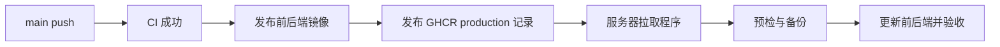

# 项目协作、验收与发布流程

> 更新：2026-09-12。适用于已有业务闭环的维护与迭代，替代项目从零立项的历史阶段教程。

## 1. 当前阶段

仓库已经包含注册登录、邮箱找回、需求草稿与补充、评估、分配、进度、交付验收、通知及管理统计功能，亦包含 GHCR 发布与服务器拉取部署程序。功能边界见[需求文档](需求文档.md)。本文件定义每次迭代如何确认、验证和交付，不作为线上验收已完成的证明。

## 2. 需求方与团队协作

| 阶段      | 团队负责                       | 需求方负责                       | 下一步条件         |
| --------- | ------------------------------ | -------------------------------- | ------------------ |
| 提交      | 解释服务范围与字段要求         | 填写背景、成果和时间，确认后提交 | 完整内容进入待评估 |
| 评估/补充 | 说明可行性、风险或具体补充问题 | 按最新公开要求补充并重新提交     | 信息与承接结论明确 |
| 分配      | 管理员安排负责人及参与者       | 查看安排与预计时间               | 分配成功进入处理中 |
| 处理      | 主负责人更新公开进度和下一步   | 需要确认时及时回应               | 成果可交付         |
| 验收      | 提供成果、使用说明和已知边界   | 验收通过或说明返工问题           | 完成或返回处理中   |

用户操作指南见[需求方使用指南](需求方使用指南.md)，准确的状态权限见[需求文档](需求文档.md)。进度说明应在平台留档，避免仅在私聊中形成另一套结论。

## 3. 团队责任

| 责任            | 产出                                           |
| --------------- | ---------------------------------------------- |
| 项目/需求负责人 | 范围、优先级、验收条件、变更取舍               |
| 前后端开发      | 实现、接口与迁移、必要回归、文档               |
| 审查与测试      | 独立检查权限/状态/异常路径，记录结果和剩余问题 |
| 发布与运维      | 环境核对、备份、部署记录、现场验收和恢复       |

小团队可兼任岗位，但每次发布必须明确责任人。阻塞应写清影响、所需信息和解决条件；不以代码量或测试数量代替交付结果。

## 4. 一次迭代的顺序

1. 确认使用角色、入口、预期行为、明确不包含的能力和验收场景。
2. 检查现有实现及依赖，识别接口、状态机、数据库和生产配置影响。
3. 从最新 main 创建任务分支；保留已有工作区修改，避免混入本次提交。
4. 完成实现和必要回归，同时更新对应文档。
5. 发起代码审查，提供测试结果；UI 变更附真实浏览器证据。
6. 在测试环境联调，验证三角色、错误输入、并发、附件和会话行为。
7. 评估数据库兼容性、发布范围和恢复方案，通过质量门禁后合并。
8. 跟踪镜像及发布记录、服务器部署结果和外网业务验收。
9. 记录正式版本或提交、执行人、时间、结果及剩余事项，清理已合并任务分支。

需求改变时重新确认受影响的验收条件。发现权限绕过、数据损坏或主流程阻断，暂停发布并修复；一般体验问题可以记录后续处理。

## 5. 验证与完成条件

自动化命令以[项目开发规范](项目开发规范.md)为准。测试使用独立环境、三类虚构账号与专用附件，不对真实需求注入故障。

| 检查     | 至少验证                                                                         |
| -------- | -------------------------------------------------------------------------------- |
| 业务闭环 | 草稿 → 提交 → 补充 → 再提交 → 可承接 → 分配 → 进度 → 交付 → 退回 → 再交付 → 通过 |
| 异常分支 | 驳回需管理员确认、创建者取消、管理员取消/重开                                    |
| 权限     | 跨用户需求访问、普通成员写入限制、内部备注和联系信息隔离                         |
| 并发     | 旧版本写入拒绝、重复验收、保存成功但提交失败后的重试                             |
| 附件     | 数量/大小/类型、上传失败恢复、下载鉴权、待绑定交付附件                           |
| 账号     | 注册开关/邮箱后缀、锁定、退出、改密、停用、密码重置凭证失效                      |
| 统计     | 日期/分类口径、零数据、成员负载、CSV 当前结果和公式注入防护                      |
| 页面     | 375/768/1024/1440px、键盘焦点、加载/空态/错误重试、减少动效偏好                  |
| 数据库   | 测试 MySQL 8.4 空库与增量 Flyway 迁移；H2 测试不能替代此项                       |

专项清单：

- [注册与登录](正式注册与登录验收清单.md)
- [邮箱找回密码](邮箱找回密码部署与验收.md)
- [需求提交与补充资料可靠性](P1需求提交与补充资料可靠性验收清单.md)

记录使用“通过 / 失败 / 未执行 / 不适用”，写明环境、提交和证据。历史测试通过不自动继承到当前版本，待执行清单不能预先打勾。

## 6. 发布通路

当前链路为：



服务器端必须完成安装、初始化、部署开关和 timer 启用后才会自动部署。仓库内默认 service 运行 dry-run；手动运行镜像工作流不会更新 production 记录。各阶段操作统一从[服务器准备指南](持续部署服务器准备指南.md)进入。

正式发布前：

- 确认提交与 CI、成对镜像 digest、发布记录一致。
- 确认环境变量已在实际服务器生效，核对注册/找回开关及 SMTP。
- 在测试数据库验证迁移，确认与上一版本应用兼容。
- 核对数据库与附件的可恢复备份、磁盘空间和回退版本。
- 控制脚本、Compose、systemd 模板有变化时单独审核安装；应用镜像发布不会自动替换这些文件。

发布后验证健康接口、登录、需求提交、附件上传下载和受影响功能；记录实际应用引用、备份位置与外网验收结果。容器 healthy 或 GitHub 发布绿色都不单独代表网站完成更新。

## 7. 故障与恢复

1. 停止后续 CD 调度并确认当前 service 是否仍在执行；停 timer 不会撤销正在运行的部署。
2. 保存脱敏日志、状态和实际镜像引用，区分网络、磁盘、配置、迁移与业务错误。
3. 检查应用回退是否成功、MySQL 身份及数据兼容性，再按[拉取端恢复流程](CD-pull-agent.md)处理。
4. 已执行的 Flyway 迁移不自动回退；恢复数据库前必须评估发布后的写入，不能只切旧镜像或直接覆盖数据库。
5. 核对修复版本及恢复后的业务，记录原因和防止复发的措施。

不得通过删除状态/锁文件、清空数据卷、改 Flyway 历史或全局 prune 来解决部署故障。

## 8. 日常维护与发布记录

定期检查应用健康、错误率、磁盘、备份可恢复性、邮件可达性和 CD 暂停状态。数据库/附件保留与异机备份是独立责任，现有 CD 只自动生成数据库备份；本地保留程序不等于完整备份方案。

每次发布记录以下内容即可，不再另复制一套阶段清单：

```text
版本/提交：
负责人、时间、环境：
改动与配置/迁移影响：
CI 与测试环境结果：
镜像及发布记录 digest：
部署与外网业务验收：
备份位置、恢复验证及回退条件：
已知问题、负责人和后续处理：
```

稳定产品变更写入 [CHANGELOG](../CHANGELOG.md)，现场日志和敏感配置不进入仓库。
