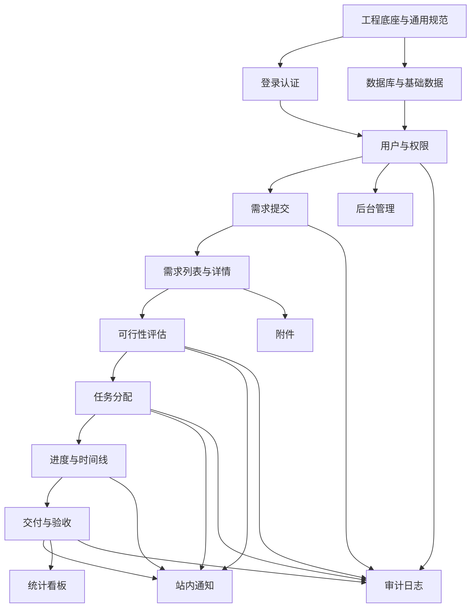
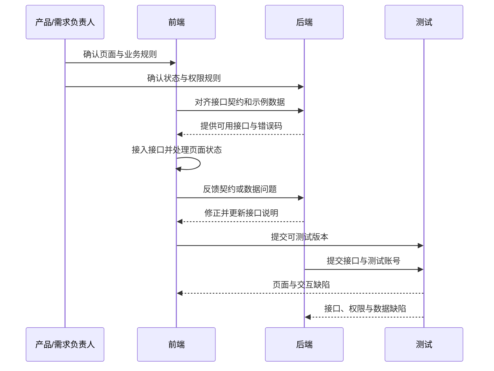
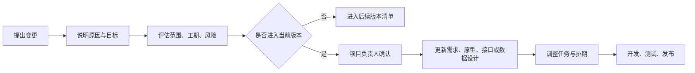

# 计算机技术组外包需求管理系统项目流程书

> 文档版本：V1.1  
> 对应需求文档：《计算机技术组外包需求管理系统需求文档》V1.0  
> 项目目标：完成需求提交、技术评估、任务分配、进度跟踪、交付验收和后台管理的 P0 闭环  
> 技术：Vue 3 + TypeScript + Spring Boot 3 + MyBatis-Plus + MySQL 8  
> 编写日期：2026-08-02

---

## 1. 文档定位

本流程书用于指导项目从立项到上线运维的完整实施过程，重点说明：

- 项目各阶段应完成的工作、交付物和进入下一阶段的条件。
- 各系统模块的开发顺序、主要步骤和依赖关系。
- 前端、后端、测试、部署之间的协作方式。
- 需求变更、缺陷、风险和版本发布的处理流程。

本文件不重复需求文档中的字段长度、页面文案等细节。开发时，业务规则以需求文档为准；实施顺序和交付要求以本流程书为准。

---

## 2. 项目总体流程

### 2.1 阶段控制原则

- 每个阶段开始前明确输入，结束时提交可检查的成果。
- 上一阶段存在影响主流程的未决问题时，不进入下一阶段。
- 开发优先保证主业务闭环，增强功能不得挤占 P0 必须功能的时间。
- 业务状态、角色权限和接口结构变更必须同步更新文档。
- 每个模块必须经过开发自测和代码审查后，才能进入集成测试。

---

## 3. 项目组织与职责

小型学生团队允许一人兼任多个岗位，但职责不能省略。

| 角色 | 主要职责 | 关键产出 |
|---|---|---|
| 项目负责人 | 确认范围、安排任务、协调进度、控制变更、组织验收 | 计划、任务清单、阶段结论、风险记录 |
| 产品/需求负责人 | 整理业务规则、确认原型、回答需求问题、维护文档 | 需求文档、流程图、原型、验收用例 |
| 前端开发 | 页面、组件、路由、状态管理、接口接入和交互校验 | 可运行前端、前端测试、构建产物 |
| 后端开发 | 数据模型、接口、认证鉴权、状态流转、文件与日志 | API 服务、迁移文件、接口文档、后端测试 |
| 测试负责人 | 制定测试范围、执行功能与权限测试、跟踪缺陷 | 测试用例、缺陷清单、测试报告 |
| 部署运维负责人 | 环境准备、部署、监控、备份、故障恢复 | 部署配置、环境说明、备份和回滚方案 |

### 3.1 协作节奏

- 每周开始：确认本周目标、负责人和验收标准。
- 开发期间：任务状态至少更新为待开发、开发中、待审查、待测试、已完成。
- 每周结束：演示已完成的可运行功能，不以代码量代替完成结果。
- 遇到阻塞：当日记录问题、影响、所需协助和预计解决时间。
- 阶段结束：项目负责人、开发和测试共同确认是否达到出口条件。

---

## 4. 项目管理基础流程

### 4.1 任务管理

1. 将需求拆分为可独立验证的模块任务。
2. 为每个任务标注优先级、负责人、依赖项和完成标准。
3. 开发者领取任务前确认依赖已具备，不在同一任务中混入无关改动。
4. 完成编码后提交自测结果并发起代码审查。
5. 审查通过后进入测试；测试通过后关闭任务。

### 4.2 代码管理

- 主分支保持可构建、可部署，不直接在主分支开发。
- 每个功能或缺陷使用独立分支，命名应能识别模块和目的。
- 合并前至少检查：构建、静态检查、自动化测试、数据库迁移和接口兼容性。
- 禁止提交真实密码、令牌、生产数据库地址和用户敏感数据。
- 版本发布使用明确标签，并保留对应变更说明。

### 4.3 完成定义

一个开发任务同时满足以下条件才视为完成：

- 实现内容符合需求和原型。
- 正常流程、异常流程和权限限制均已处理。
- 代码通过格式检查、类型检查和必要测试。
- 接口、配置或数据库发生变化时，相关文档已更新。
- 已通过代码审查和测试验证，没有阻断级缺陷。

---

## 5. 第一阶段：项目立项

### 5.1 主要步骤

1. 明确系统服务对象为需求方、技术组成员和管理员。
2. 确认首期目标是完成需求处理闭环，不包含支付、合同、复杂工时和即时聊天。
3. 确认开发人员、项目负责人、预期周期和可用服务器资源。
4. 确定沟通渠道、代码仓库、任务管理方式和文档存放位置。
5. 建立初始风险清单，重点确认成员时间、服务器、域名、文件存储和数据合规问题。

### 5.2 阶段产出

- 项目目标和 P0 范围。
- 项目成员与职责表。
- 初步里程碑和时间安排。
- 技术资源清单与风险清单。

### 5.3 出口条件

- 项目范围、负责人和可投入资源均已明确。
- 团队对首期不做的内容达成一致。
- 代码、任务和文档的协作位置已经建立。

---

## 6. 第二阶段：需求确认

### 6.1 主要步骤

1. 按需求方、技术组成员、管理员三个视角梳理核心使用场景。
2. 确认需求从草稿、评估、分配、处理到验收的状态流转。
3. 确认每个角色在各状态下可以查看的信息和执行的操作。
4. 确认需求表单、评估表、进度记录、交付验收的核心信息。
5. 将功能分为 P0、P1、P2，首期只排入 P0。
6. 将业务要求转换为可验证的验收场景。
7. 邀请技术组实际使用人员评审，关闭影响开发的歧义。

### 6.2 阶段产出

- 评审后的需求文档。
- 角色权限矩阵。
- 业务状态图和异常流程说明。
- P0 功能清单与验收标准。

### 6.3 出口条件

- 主业务状态和角色权限不存在未确认项。
- 所有 P0 功能都能对应到明确的页面或接口。
- 项目负责人确认需求基线，后续新增内容按变更流程处理。

---

## 7. 第三阶段：产品与技术设计

### 7.1 页面与交互设计步骤

1. 根据角色划分登录页、需求方页面、技术组工作台和管理后台。
2. 绘制首页、需求表单、需求列表、需求详情和管理页面线框图。
3. 确定导航、状态标签、表格、表单、时间线和操作按钮的统一样式。
4. 标明加载、空数据、提交成功、权限不足和服务器错误等页面状态。
5. 按桌面端和手机端检查主要操作是否可完成。
6. 用典型需求数据进行原型走查，确认页面信息足以支撑业务流程。

### 7.2 技术设计步骤

1. 确认前后端分离的单体架构，不引入微服务。
2. 固定后端为 Java、Spring Boot 3、MyBatis-Plus 和 MySQL 8，使用 Maven Wrapper 管理构建。
3. 设计用户、需求、成员关系、评估、进度、状态历史、附件和分类等数据表。
4. 使用 Flyway 管理数据库结构变更，不依赖 MyBatis-Plus 自动建表。
5. 定义统一的接口路径、请求结构、响应结构、分页方式和错误码，并用 OpenAPI 维护前后端契约。
6. 将状态流转实现为 Spring Service 层的统一规则，避免 Controller 或 Mapper 直接修改状态。
7. 使用 Spring Security 设计登录会话、角色鉴权和资源归属校验。
8. 确认附件保存、下载鉴权、数据库备份和日志保留方案。
9. 列出开发、测试、生产环境的 Spring Profile、前端配置和基础设施差异。

### 7.3 阶段产出

- 页面原型或线框图。
- 数据模型和数据库设计。
- 接口清单与通用约定。
- 权限校验、状态流转、文件存储和部署方案。

### 7.4 出口条件

- 主要页面、数据实体和接口能够一一对应。
- 开发人员理解模块边界和依赖关系。
- 安全、部署和备份不再留到上线前临时决定。

---

## 8. 第四阶段：工程初始化

### 8.1 仓库与目录

1. 建立 `frontend`、`backend`、`docs`、`deploy` 目录；后端迁移脚本放在 `backend/src/main/resources/db/migration`。
2. 前端配置 TypeScript 严格模式、ESLint、Prettier；后端配置 Maven、Java 编译版本、格式检查和测试插件。
3. 通过 OpenAPI 文档和 DTO 约定同步前后端类型，不直接共享 TypeScript 源文件。
4. 提供前端环境变量示例和后端 `application-*.yml` 配置说明，区分开发、测试和生产环境。
5. 编写本地启动、Flyway 迁移、测试数据初始化和测试执行说明。

### 8.2 前端基础

1. 初始化 Vue、Vite、Vue Router、Pinia 和 Element Plus。
2. 建立公共布局、路由守卫、请求封装、错误处理和权限指令。
3. 建立表单、列表、状态标签、空状态和确认弹窗等通用组件。
4. 配置开发环境 API 代理和生产环境构建。

### 8.3 后端基础

1. 使用 JDK 21 和 Maven Wrapper 初始化 Spring Boot 3 项目，引入 Spring Web、Validation、Security、MyBatis-Plus、MySQL Driver、Flyway 和 Actuator。
2. 按业务模块建立 Controller、Service、Mapper、Entity、DTO、VO 和枚举目录，禁止 Controller 直接调用 Mapper。
3. 配置 MyBatis-Plus 分页、乐观锁、自动填充和必要的逻辑删除能力。
4. 建立 MySQL 连接、Flyway 迁移和开发测试数据初始化流程。
5. 使用 Bean Validation、全局异常处理器和统一响应对象，统一错误码、请求编号和分页结构。
6. 使用 Spring Security 建立认证、角色鉴权、资源鉴权、会话失效和接口限流规则。
7. 使用 Spring Boot Actuator 提供受控的健康检查接口，供部署环境判断服务状态。

### 8.4 持续集成

1. 前端执行 pnpm 锁文件安装、ESLint、类型检查、Vitest 和生产构建。
2. 后端执行 Maven Wrapper 编译、格式检查、JUnit 5/MockMvc 测试和打包。
3. 在独立 MySQL 测试库验证 Flyway 迁移和 MyBatis-Plus 数据访问。
4. 任一步骤失败则阻止合并。
5. 对数据库迁移和环境配置缺失提供明确错误。

### 8.5 出口条件

- 新成员根据说明可在本地启动前端、后端和数据库。
- 前后端能通过健康检查接口完成首次通信。
- 前端可使用 pnpm 构建，后端可使用 Maven Wrapper 独立打包。
- 基础检查可自动运行，仓库中不存在真实密钥。

---

## 9. 模块开发顺序与依赖

开发时允许前后端并行，但应先确定数据结构和接口契约。核心闭环模块优先于通知、统计和视觉优化。

---

## 10. 各模块实施流程

### 10.0 Spring Boot 模块统一落地顺序

每个后端业务模块按相同顺序实现，避免 Controller、数据库和页面各自先行导致返工：

1. 根据需求和状态规则新增 Flyway SQL，先确定表、约束、索引和历史数据处理方式。
2. 建立 Entity、业务枚举、请求 DTO 和响应 VO；禁止直接用 Entity 接收或返回接口数据。
3. 建立 MyBatis-Plus Mapper；简单查询使用 Lambda Wrapper，复杂关联查询使用明确的 XML SQL。
4. 在 Service 实现资源权限、状态校验、事务和 Entity/VO 转换。
5. 在 Controller 使用 Bean Validation 接收参数，并通过 Spring Security 获取当前用户。
6. 使用 springdoc-openapi 更新接口契约，前端据此维护 TypeScript 接口类型。
7. 后端完成 JUnit 5、Mockito、MockMvc 和必要的 MySQL 集成测试后，前端再接入真实接口。
8. 联调通过后补齐日志、审计、错误码和模块文档，再进入代码审查。

### 10.1 登录认证模块

**目标：** 建立可靠的登录状态，为后续所有权限控制提供基础。

实施步骤：

1. 使用 Flyway 创建用户、角色、账号状态和 Spring Session 相关表，并准备管理员测试账号。
2. 使用 Spring Security、PasswordEncoder 和 Spring Session JDBC 实现登录、退出、当前用户查询和会话失效。
3. 增加登录失败次数限制、停用账号限制、CSRF 防护和 SecurityFilterChain 访问规则。
4. 前端实现登录页、登录状态存储、路由守卫和会话过期处理。
5. 使用 MockMvc 和三类测试账号验证正确登录、错误密码、账号锁定、主动退出、CSRF 和过期跳转。

完成结果：三类角色能够登录，未登录用户不能访问业务接口，退出后原会话不可继续使用。

### 10.2 用户与权限模块

**目标：** 控制不同角色能够访问的页面、接口和业务数据。

实施步骤：

1. 固化需求方、技术组成员、管理员三种角色及基础权限。
2. 后端建立角色鉴权和资源归属校验，统一处理禁止访问结果。
3. 前端按角色生成菜单，并控制按钮和页面入口。
4. 实现个人资料查看、修改密码和必要的账号状态展示。
5. 使用不同角色账号测试页面访问、接口调用和跨用户数据访问。

完成结果：前端入口与后端权限一致，不依赖前端隐藏来保护数据。

### 10.3 分类与基础配置模块

**目标：** 为需求表单、筛选和成员分配提供可维护的基础数据。

实施步骤：

1. 建立需求分类、技能标签和基础配置的数据结构。
2. 准备默认分类与管理员账号种子数据。
3. 后端提供启用项查询和管理员维护接口。
4. 前端在表单、筛选和管理页面接入基础数据。
5. 验证停用分类不会破坏历史需求，只限制新需求选择。

完成结果：基础数据可集中维护，业务页面不硬编码可变分类。

### 10.4 需求提交模块

**目标：** 让需求方完整创建、保存和提交需求。

实施步骤：

1. 建立需求主表、编号规则、草稿和提交状态。
2. 后端实现创建草稿、编辑草稿、提交、补充资料和允许状态下取消需求。
3. 在提交操作中执行字段校验、编号生成和状态历史记录。
4. 前端实现分组表单、校验、草稿保存、离开提醒和提交反馈。
5. 接入分类、联系方式和附件选择，避免重复提交。
6. 测试草稿继续编辑、校验失败、提交成功、重复点击和非法状态修改。

完成结果：需求提交后生成唯一编号，并进入技术组待评估范围。

### 10.5 需求列表与详情模块

**目标：** 为需求方和技术组提供各自权限范围内的查询入口。

实施步骤：

1. 后端实现按角色限制数据范围的列表查询、分页、搜索和筛选。
2. 实现需求详情聚合查询，返回基础信息、评估、成员、进度和状态历史。
3. 对公开记录与内部记录分别过滤，不向需求方返回内部信息。
4. 前端实现“我的需求”、需求池、详情页和状态标签。
5. 在详情页根据角色和当前状态显示允许的操作。
6. 测试空列表、无结果、分页边界、越权访问和移动端展示。

完成结果：用户只看到有权查看的数据，列表能进入信息完整的详情页。

### 10.6 附件模块

**目标：** 支持需求资料和交付文件的安全上传与下载。

实施步骤：

1. 定义文件数量、大小、类型、保存目录和清理规则。
2. 后端实现上传、元数据保存、随机存储名和下载鉴权。
3. 前端实现上传进度、失败重试、文件列表和删除未提交附件。
4. 将附件与需求、进度或交付记录建立明确关联。
5. 测试超限文件、危险类型、无权限下载、记录存在但文件丢失等情况。

完成结果：附件不可通过猜测路径绕过权限访问，异常上传不会留下无主文件。

### 10.7 可行性评估模块

**目标：** 让技术组对已提交需求形成明确、可追溯的评估结论。

实施步骤：

1. 建立评估记录、评估版本和三种结论对应的状态规则。
2. 后端实现评估创建、必填条件校验、状态变更和历史保留。
3. 前端在需求详情中提供评估表和历史评估展示。
4. 对公开说明和内部备注分别控制可见范围。
5. 验证需补充、可承接、不承接三条流程及重复评估行为。

完成结果：每次评估有操作者、时间、结论和说明，需求自动进入正确状态。

### 10.8 任务分配与成员协作模块

**目标：** 为可承接需求确定主负责人和参与成员。

实施步骤：

1. 建立需求与成员关联，区分主负责人和参与者。
2. 后端实现管理员分配、转交、调整参与者和授权认领。
3. 分配时检查成员账号状态、需求状态和负责人唯一性。
4. 前端展示成员技能和当前任务数量，提供分配与认领入口。
5. 将负责人变化写入状态历史或审计日志。
6. 测试重复分配、停用成员、无权认领和负责人转交。

完成结果：进入处理中的需求有且只有一名主负责人，历史责任人可追溯。

### 10.9 进度与时间线模块

**目标：** 记录实际处理过程，并向需求方展示可公开进度。

实施步骤：

1. 建立进度记录和统一时间线展示结构。
2. 后端实现进度新增、可见范围、百分比校验和最近更新时间计算。
3. 将提交、评估、分配、状态变化、交付和验收转换为时间线事件。
4. 前端实现进度编辑和按时间倒序或正序展示的时间线。
5. 在工作台标记长时间未更新或临近截止日期的需求。
6. 测试内部记录隔离、非法百分比、无负责人更新和并发更新。

完成结果：技术组可持续记录工作，需求方能看到准确且不泄露内部信息的进度。

### 10.10 交付与验收模块

**目标：** 完成从处理中到已完成的最终业务闭环。

实施步骤：

1. 建立交付记录和验收结果数据结构。
2. 后端实现负责人提交交付、需求方验收通过和验收退回。
3. 在状态流转中限制操作者、当前状态和必填说明。
4. 前端提供交付说明、交付文件或链接以及验收反馈入口。
5. 验收通过后锁定核心需求数据；重新开启仅允许管理员操作并记录原因。
6. 测试无交付内容、非负责人提交、非创建者验收、重复验收和返工流程。

完成结果：需求可在“处理中—待验收—已完成/退回处理中”之间按规则流转。

### 10.11 站内通知模块

**目标：** 让相关人员及时得知需要处理的事项。

实施步骤：

1. 确定通知事件：需求提交、要求补充、评估完成、负责人分配、进度更新、交付和验收。
2. 建立站内通知数据结构和已读状态。
3. 在业务操作成功后创建通知，业务失败时不得产生通知。
4. 前端提供未读数量、通知列表和跳转到需求详情的入口。
5. 测试通知接收人、重复通知、已读状态和已删除关联数据。

完成结果：关键待办有站内提示；邮件、短信等外部渠道留作后续增强。

### 10.12 管理后台模块

**目标：** 为管理员提供人员、分类和异常需求的集中维护能力。

实施步骤：

1. 实现成员列表、新增、编辑、启停用、角色和技能维护。
2. 实现需求分类新增、排序和停用。
3. 提供全部需求查询、负责人调整、异常状态处理和归档入口。
4. 对高影响操作增加二次确认和必填原因。
5. 将所有管理操作写入审计日志。
6. 使用管理员和普通成员账号分别验证访问权限。

完成结果：管理员可处理日常配置和异常情况，普通成员无法调用管理功能。

### 10.13 统计看板模块

**目标：** 展示能支持日常管理的基础数据，不建设复杂分析平台。

实施步骤：

1. 确认统计口径，包括新增数、完成数、状态分布、分类分布和首次响应时间。
2. 后端按统一时间范围和状态定义提供聚合接口。
3. 前端展示统计卡片和简单图表，并提供时间范围选择。
4. 使用固定样本数据核对接口结果与人工计算结果。
5. 对无数据、部分数据和较大时间范围进行性能检查。

完成结果：管理员能掌握需求数量、处理情况和基本响应效率，统计口径可解释。

### 10.14 审计与系统日志模块

**目标：** 让关键业务变化可追踪，并为故障排查提供依据。

实施步骤：

1. 确定审计范围：登录、角色变更、需求状态、评估、分配、交付、验收和管理员操作。
2. 记录操作者、目标对象、操作类型、变更前后信息、时间和请求编号。
3. 业务日志避免写入密码、令牌和不必要的完整个人信息。
4. 管理端提供基础查询，审计记录不提供普通删除或编辑入口。
5. 配置应用日志分级、保留期限和异常告警方式。

完成结果：关键操作可追溯，发生错误时能通过请求编号关联前后端和服务器日志。

---

## 11. 前后端联调流程

### 11.1 联调步骤

1. 后端先提供接口结构、示例请求、示例响应和错误码。
2. 前端可使用模拟数据开发页面，但字段必须与接口契约一致。
3. 单个模块接口可用后立即联调，不等全部后端完成。
4. 联调先验证正常流程，再验证无权限、参数错误、状态冲突和服务异常。
5. 发现接口不一致时修改契约并同步双方，不在前端长期保留临时字段转换。
6. 主闭环联调完成后，使用三个真实角色账号走通完整流程。

### 11.2 联调出口条件

- 所有 P0 页面均已连接真实接口。
- 正常和主要异常场景均有正确反馈。
- 权限与状态流转由后端最终控制。
- 不存在阻断主流程的临时模拟数据或硬编码账号。

---

## 12. 测试流程

### 12.1 测试准备

1. 建立独立测试环境和可重复初始化的测试数据。
2. 准备需求方、成员、管理员账号及启用/停用等边界账号。
3. 按业务闭环、角色权限和异常情况编写测试用例。
4. 明确阻断、严重、一般、建议四级缺陷标准。

### 12.2 测试执行顺序

1. 开发自测：开发者验证本模块正常、异常和权限场景。
2. 模块测试：测试人员按模块检查页面、接口和数据库结果。
3. 集成测试：验证跨模块状态、通知、时间线和附件关联。
4. 回归测试：修复缺陷后复测影响模块和完整主流程。
5. 安全测试：重点检查越权、会话、上传、输入内容和敏感日志。
6. 兼容与响应式测试：检查目标浏览器和手机宽度。
7. 验收测试：由实际需求方和技术组成员按真实场景试用。

### 12.3 缺陷处理流程

### 12.4 测试出口条件

- 主业务闭环全部通过。
- 不存在阻断和严重级未关闭缺陷。
- 一般缺陷有明确处理结论，不影响本次上线目标。
- 权限、安全、备份恢复和部署检查已经完成。
- 测试负责人提交测试报告并给出上线建议。

---

## 13. 部署上线流程

### 13.1 环境准备

1. 准备 Linux 服务器、域名、HTTPS 证书、数据库和文件存储目录。
2. 安装 Docker 与 Docker Compose，限制不必要的外部端口。
3. 创建 Spring `prod` Profile、数据源、会话和文件存储相关环境变量，不使用开发默认值。
4. 建立数据库和附件备份目录，并确认磁盘空间和访问权限。
5. 配置 Nginx、Spring Boot Actuator 健康检查、日志和基本监控。

### 13.2 发布步骤

1. 冻结发布范围，确认待发布代码、数据库迁移和配置变更。
2. 运行前端 `pnpm build` 和后端 Maven `verify/package`，在测试环境使用与生产一致的容器完成预发布。
3. 备份当前数据库、附件和部署配置。
4. 构建前端 Nginx 镜像和 Spring Boot JRE 镜像，先验证 Flyway，再执行增量迁移。
5. 启动服务并检查 Actuator、数据库、API、前端和文件存储连接。
6. 执行冒烟测试：登录、提交需求、评估、分配、更新进度和验收。
7. 确认日志无持续错误后开放访问，并记录版本和发布时间。

### 13.3 回滚流程

1. 出现数据损坏、安全问题或主流程不可用时停止继续发布。
2. 根据问题判断回滚应用版本还是同时回滚数据库。
3. 应用回滚使用上一稳定镜像；已执行的 Flyway 迁移不得直接删除或修改，数据库仅按已验证的前向修复或恢复方案操作。
4. 回滚后执行健康检查和主流程冒烟测试。
5. 记录故障原因、影响、处理过程和后续预防措施。

### 13.4 上线出口条件

- 生产环境全站使用 HTTPS，默认账号和默认密钥已替换。
- 主流程冒烟测试通过，日志和健康检查正常。
- 数据库和附件备份任务已实际运行并可验证。
- 管理员、技术组成员和需求方均有可用入口及使用说明。

---

## 14. 试运行与项目验收

### 14.1 试运行

1. 先向少量技术组成员和真实需求方开放系统。
2. 选择若干不同分类的需求完成完整处理流程。
3. 收集表单理解、评估效率、进度展示和移动端使用问题。
4. 每日检查错误日志、未处理需求、失败上传和异常状态。
5. 只修复影响使用的问题，新增功能进入后续版本清单。

### 14.2 验收流程

1. 根据需求文档的验收标准准备验收用例和测试账号。
2. 依次演示登录、需求提交、评估、分配、进度、交付、验收和后台管理。
3. 展示权限隔离、状态历史、附件权限、备份和部署说明。
4. 记录未通过项、责任人和修复期限。
5. 所有必须项通过后，由项目负责人确认 P0 验收完成。

### 14.3 验收交付物

- 前后端源代码和版本标签。
- 数据库模型、迁移文件和初始数据说明。
- 需求文档、项目流程书、接口说明和部署说明。
- 测试用例、测试报告和已知问题清单。
- 管理员操作说明、普通用户简要使用说明。
- 备份、恢复和版本回滚说明。

---

## 15. 运行维护流程

### 15.1 日常检查

- 检查服务健康、错误日志、数据库连接、磁盘和附件存储空间。
- 检查备份是否成功，并定期抽查备份能否恢复。
- 检查连续登录失败、异常上传和疑似越权等安全事件。
- 检查长期待评估、待补充、待验收或长时间未更新的需求。

### 15.2 用户与数据维护

- 成员离组后及时停用账号并转交其负责需求。
- 分类调整使用停用，不直接删除已有历史数据。
- 敏感附件按既定期限清理，清理前确认业务和合规要求。
- 管理员高影响操作定期复核审计记录。

### 15.3 故障处理

1. 确认故障范围：单用户、单模块或全站。
2. 通过请求编号、应用日志、数据库和服务器状态定位原因。
3. 优先恢复服务，再处理非阻断问题。
4. 涉及数据时先备份当前状态，禁止直接进行无记录修改。
5. 恢复后验证主流程，并记录故障复盘和预防措施。

---

## 16. 需求变更流程

变更必须至少记录：提出人、变更内容、业务原因、影响模块、预计工作量、是否影响上线时间和最终结论。

以下情况必须执行正式变更评估：

- 新增角色、业务状态或核心流程分支。
- 修改已发布接口、数据表或权限范围。
- 新增支付、合同、外部通知等超出 P0 的能力。
- 影响已完成模块返工或改变验收标准。

文字调整、样式微调和不影响业务规则的缺陷修复，可由负责人直接纳入当前迭代，但仍需记录任务。

---

## 17. 版本与迭代流程

### 17.1 版本划分

- P0：完成账号、需求、评估、分配、进度、交付验收、基础管理和部署。
- 后续小版本：修复缺陷、改善交互、补充报表或通知能力。
- 较大版本：引入统一认证、子任务、复杂统计或外部系统集成。

### 17.2 每次迭代步骤

1. 从问题和需求清单中选择本次范围。
2. 明确负责人、依赖、完成标准和发布时间。
3. 更新设计后完成开发、自测、审查和集成测试。
4. 在测试环境回归主流程。
5. 发布并记录新增、变更、修复和已知问题。
6. 观察运行情况，将新问题进入下一轮清单。

---

## 18. 建议里程碑

按 2～4 名学生成员、每周固定课余时间估算：

| 里程碑 | 建议周期 | 主要完成内容 | 阶段检查点 |
|---|---:|---|---|
| M1：需求与设计基线 | 第 1 周 | 范围、状态、权限、原型、数据和接口设计 | 主流程无关键歧义 |
| M2：工程与账号基础 | 第 2 周 | 工程底座、数据库、登录、用户和权限 | 三角色可登录且权限有效 |
| M3：需求入口可用 | 第 3 周 | 分类、需求表单、附件、列表和详情 | 需求可提交并进入待评估 |
| M4：处理闭环可用 | 第 4～5 周 | 评估、分配、进度、交付和验收 | 完整业务链路可演示 |
| M5：管理与质量完善 | 第 6 周 | 管理、通知、统计、审计、响应式适配 | P0 模块完成并进入测试 |
| M6：测试与上线 | 第 7 周 | 系统测试、修复、部署、备份、试运行 | 无阻断问题，生产可用 |

实际周期可按团队人数调整，但里程碑顺序不建议改变。

---

## 19. 项目交付检查清单

### 19.1 功能

- [ ] 三类角色可以登录并获得正确权限。
- [ ] 需求方可以保存草稿、提交、补充、取消和查看进度。
- [ ] 技术组可以评估、分配、更新进度和提交交付。
- [ ] 需求方可以验收通过或退回处理。
- [ ] 管理员可以维护成员、分类和异常需求。
- [ ] 关键状态和操作记录可追溯。

### 19.2 质量

- [ ] 静态检查、构建和自动化测试通过。
- [ ] 主流程、异常流程和角色越权测试通过。
- [ ] 手机端和目标浏览器可完成主要操作。
- [ ] 文件上传、下载和可见范围符合权限要求。
- [ ] 没有阻断或严重级未关闭缺陷。

### 19.3 部署与运维

- [ ] 生产配置不包含默认密钥或弱密码。
- [ ] HTTPS、数据库、文件存储和健康检查正常。
- [ ] 数据库和附件已配置自动备份。
- [ ] 已完成一次备份恢复或恢复演练。
- [ ] 部署、回滚、管理员操作和用户使用说明齐全。

---

## 20. 项目完成判定

项目达到以下条件时，可宣布 P0 正式完成：

1. 需求从提交到完成归档的完整链路在生产环境可稳定运行。
2. 三类角色的数据范围和操作权限符合需求文档。
3. 所有 P0 功能通过验收，不存在影响主流程的已知缺陷。
4. 源代码、数据库迁移、配置示例和文档已完整交付。
5. 生产环境具备 HTTPS、日志、健康检查、备份和基本恢复能力。
6. 至少完成一轮真实用户试运行，并对主要反馈给出处理结论。
